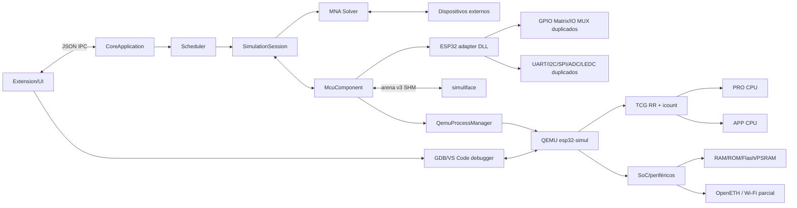
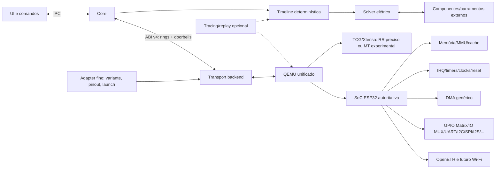
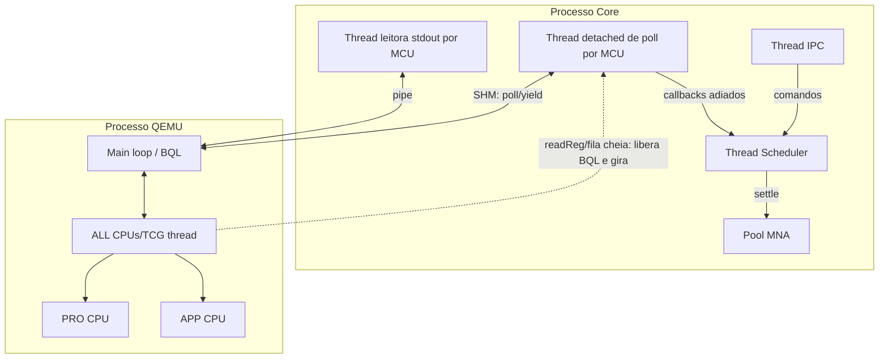
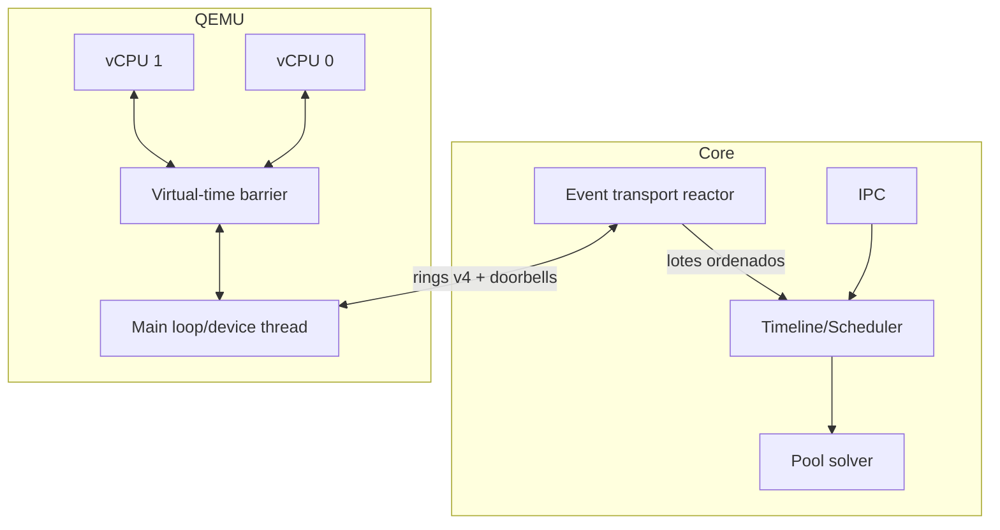
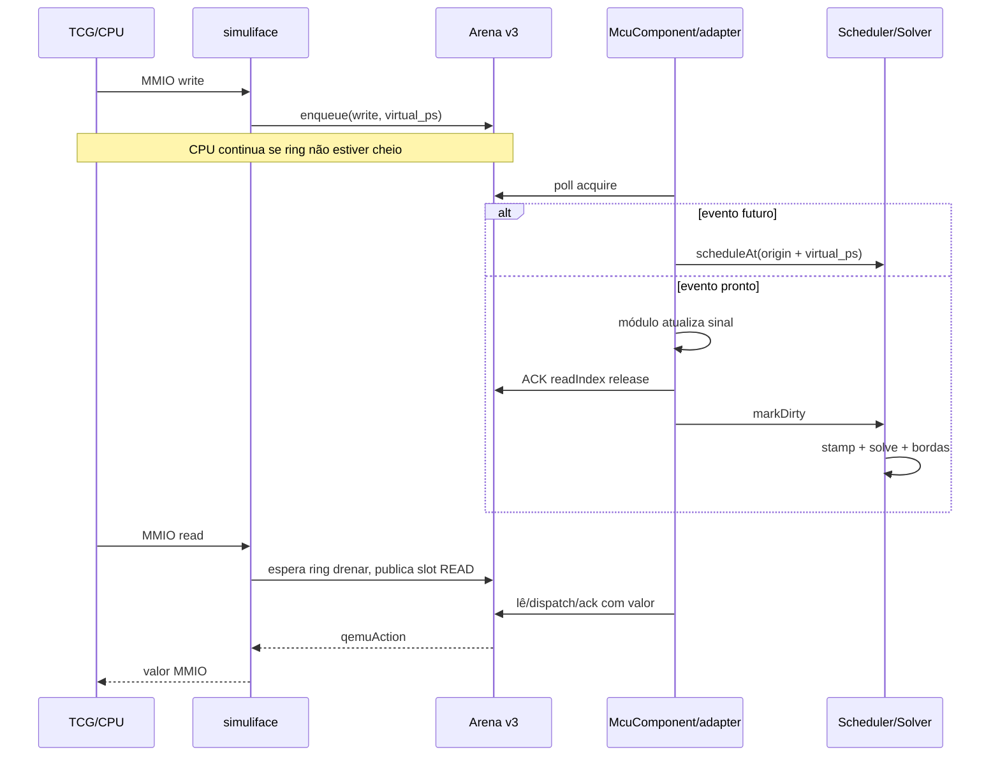
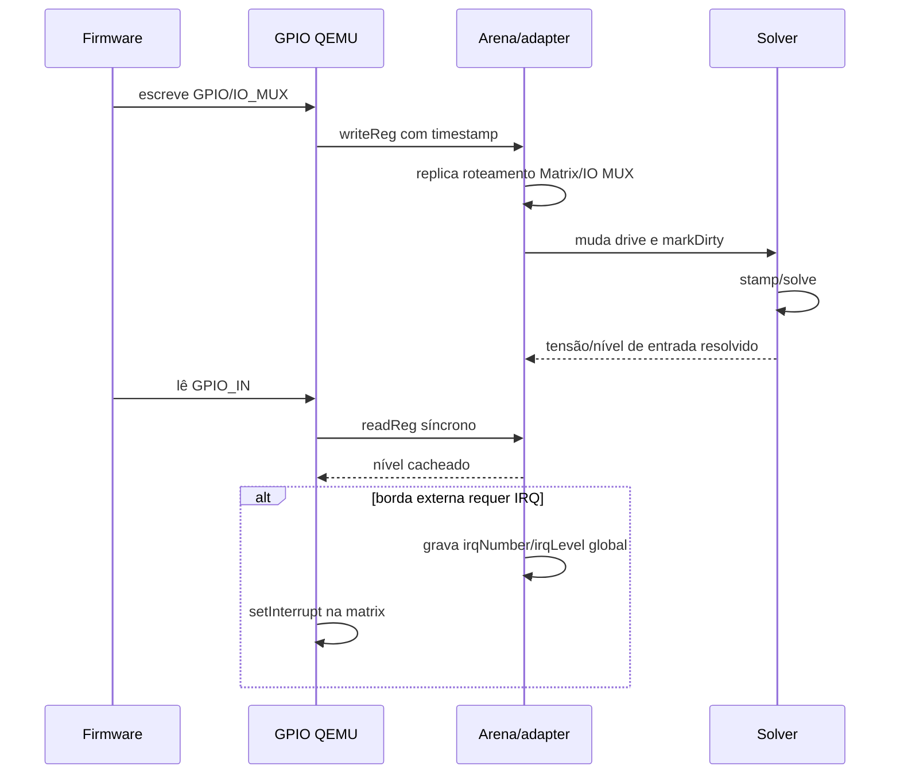
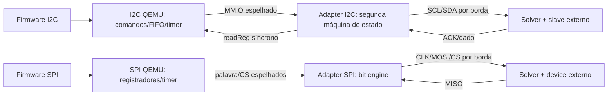
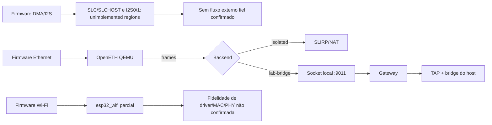
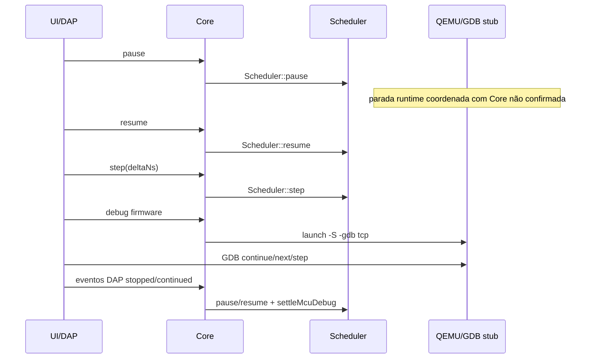
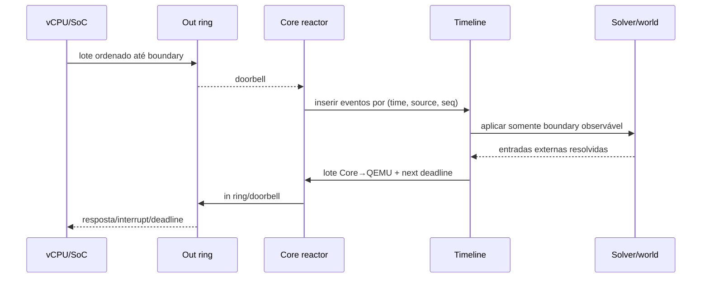

# Arquitetura ESP32 de alta performance — diagnóstico e plano

> Data da inspeção: 2026-07-25. Escopo primário: `C:\SourceCode\qemu_lasecSimul` (QEMU 8.1.3,
> commit `924e2db`) e `C:\SourceCode\LasecSimul` (commit `e6d5351`, mais alterações locais não
> commitadas explicitamente identificadas). Este documento não implementa código.

> Atualização de implementação: a primeira alteração estrutural foi concluída no fork QEMU pelo
> commit `f21f457c0f11660370a5745d6e41441bf421c90f`. A SoC `xtensa.esp32` passou a ser única;
> `esp32-simul` é uma máquina derivada que preserva as diferenças de integração do LasecSimul.
> Também foram incorporados repeated-START, leitura e ACK/NACK reais no I2C, delimitação por CS no
> SPI e consumo atômico da injeção de IRQ.
>
> Atualização posterior: após as correções de concorrência do commit QEMU `ec22444` e a correção
> definitiva de relógio/reset multicore do commit `f3e3cebbc119b792dca69860d5b0f02a268ac0b7`, os
> testes sustentados e a validação do firmware real (23% → 98%), MTTCG passou a ser o padrão. O
> modo anterior permanece disponível com `LASECSIMUL_ESP32_EXECUTION_MODE=deterministic`. Consulte
> `docs/36-mttcg-esp32-experimental-2026-07-25.md`.

## 1. Resumo executivo

A plataforma já contém ativos importantes: duas CPUs Xtensa reais do QEMU, mapa de memória e boot
funcionais, matriz de interrupções, timers, flash/PSRAM, GDB stub, processo isolado por MCU e um
sincronismo Core–QEMU que preserva timestamps virtuais. O protocolo v3 eliminou o ping-pong em toda
escrita ao introduzir uma fila SPSC de 32 entradas e mantém leituras síncronas ordenadas. O Core
também já limita seu avanço pela posição da MCU mais lenta e aplica as transições no solver no
timestamp publicado.

Os principais problemas estruturais comprovados são:

1. `esp32.c` e `esp32-simul.c` duplicam quase toda a máquina/SoC; o diff tem 912 linhas.
2. A máquina `esp32-simul` usa `-icount`; por regra do próprio QEMU, isso desativa MTTCG. As duas
   CPUs existem, porém dividem uma única thread TCG em round-robin.
3. Parte relevante da SoC está incompleta ou é stub: RTCIO, HINF, SLC/SLCHOST, APBCTRL, I2S0/1,
   blocos PHY/Wi-Fi, Bluetooth e outros.
4. Não há DMA clássico genérico para ESP32; o único GDMA encontrado é o da ESP32-C3.
5. O adapter reimplementa comportamento interno de GPIO Matrix/IO MUX, UART, I2C, SPI, ADC e LEDC.
   Isso divide a verdade da SoC entre QEMU e DLL e transforma transações em bit-banging no Core.
6. A ABI compartilhada é espelhada manualmente em dois repositórios, não possui cabeçalho de
   versão/tamanho/capacidades dentro da arena e usa um único slot global para IRQ Core→QEMU.
7. As esperas de leitura e fila cheia são busy-waits com limites por número de iterações, não
   deadlines de tempo; liberam o BQL, mas ainda consomem CPU de host.
8. O polling dedicado por MCU usa `yield()` quando não há evento. Resolve o bloqueio da thread do
   scheduler, mas ainda pode consumir CPU ociosa e cria uma thread destacada por MCU.
9. A rede funcional hoje é OpenETH. `WiFi.begin()` não é equivalente a esse caminho; o controlador
   Wi-Fi existente é parcial. O modo `isolated` usa SLIRP sem TAP; `lab-bridge` usa gateway/TAP e
   possui fallback para SLIRP quando o gateway não responde.
10. Há instrumentação parcial do Core, mas não existe uma baseline atual completa que permita
    atribuir custo a TCG, sincronismo, adapter, solver, UI e rede na mesma execução.

Recomendação inequívoca: adotar a **Alternativa A — evolução profunda da arquitetura atual**,
preservando inicialmente processo separado, TCG/Xtensa, semântica temporal e solver. Unificar as
máquinas `esp32`/`esp32-simul`; criar uma fronteira genérica de eventos de pino/transação; mover
modelos de periféricos para o QEMU; reduzir o adapter a inicialização, metadados, pinagem e transporte;
e introduzir uma ABI v4 versionada com filas bidirecionais e notificação bloqueante somente depois de
medir a v3. MTTCG deve ser um experimento posterior, coexistente com o modo determinístico `icount`,
e não a primeira mudança.

## 2. Metodologia da análise

Foram usados:

- inventário por nomes, símbolos e registros QOM;
- leitura das máquinas `esp32` e `esp32-simul`;
- rastreamento do lançamento desde `Esp32Adapter::buildLaunchArgs` até `simuMain`;
- rastreamento de uma escrita, leitura e interrupção pela arena;
- inspeção do scheduler, solver, polling de MCU, pacing, pausa e GDB;
- busca explícita de `TODO`, `FIXME`, `unimplemented`, retornos fixos e dispositivos dummy;
- comparação do QEMU limpo com as mudanças locais em I2C/SPI;
- inspeção dos testes QEMU, Core e adapter;
- confronto com o TRM e documentação oficial, sem inferir implementação a partir deles.

Convenção:

| Marca | Significado |
|---|---|
| **Fato** | comprovado por arquivo/símbolo ou teste existente |
| **Observado** | resultado registrado em teste/perfil anterior, com contexto indicado |
| **Risco** | consequência possível sustentada pela estrutura do código, ainda não medida |
| **Hipótese** | explicação que exige instrumentação |
| **Recomendação** | decisão proposta |
| **NC** | não confirmado com as evidências disponíveis |

Graus de confiança: alta (fluxo direto no código), média (composição de vários fluxos) e baixa
(depende de medição ou comportamento externo).

## 3. Escopo efetivamente inspecionado

### QEMU

- `hw/xtensa/esp32.c`, `esp32-simul.c`, `esp32_intc.c`;
- `target/xtensa/core-esp32.c`, configuração ISA, MMU, GDB e tradutor Xtensa;
- `hw/gpio/esp32_gpio.c`, `hw/misc/esp32_iomux.c`, DPORT, RTC, LEDC, sensores, criptografia,
  eFuse, cross-core, Wi-Fi e stubs;
- UART, I2C, SPI, RMT, FRC timers, timer groups e watchdogs;
- máquina ESP32-C3 e seu GDMA/cache como referência interna, não como implementação da ESP32;
- `softmmu/simuliface.c/.h`, `softmmu/runstate.c`;
- seleção RR/MTTCG e `icount` em `accel/tcg`;
- OpenETH, SLIRP/socket e teste `tests/qtest/esp32-network-test.c`;
- build `build-ucrt64` e binário distribuído.

### LasecSimul

- `qemu_arena_abi.h`, `QemuArenaBridge`, `QemuProcessManager`, `McuController`;
- `McuComponent`, `Scheduler`, `SimulationSession`, `MnaSolver` e `CircuitGroup`;
- `Esp32Adapter.cpp` e ABI de MCU;
- fluxo de rede e provisionamento TAP/gateway;
- GDB via Extension/Core;
- testes de arena, stress de fila, múltiplas MCUs, pacing real/sintético, restart, adapter e rede.

## 4. Limitações da análise

- Não foi executada uma campanha nova de profiling fim a fim; números históricos não são baseline
  do commit atual.
- Não foi comparado cada registrador com o TRM; o inventário classifica cobertura estrutural, não
  conformidade bit a bit.
- Os dois repositórios têm mudanças locais. No QEMU: `hw/i2c/esp32_i2c.c`,
  `hw/ssi/esp32_spi.c` e artefatos de build. No LasecSimul, durante a inspeção, havia mudanças em
  `QemuModule.hpp`, `mcu_abi.h` (minor 8/pulls internos), `McuComponent.*`,
  `QemuModuleProxy.hpp`, adapter/teste do adapter e binário QEMU. Elas foram lidas como estado de
  trabalho, mas não tratadas como versão publicada e não foram alteradas por este documento.
- Não houve captura em ESP32 física nesta etapa.
- Fidelidade de Wi-Fi MAC/PHY, coerência de cache sob DMA, arbitragem I2C, SPI slave e pausa por
  núcleo são **não confirmadas com as evidências disponíveis**.
- O histórico do fork QEMU tem um único commit (“first commit”), portanto não é possível atribuir
  patches a upstream/origem só pelo Git.

## 5. Mapa da arquitetura atual

O adapter lança um processo QEMU por componente com:

```text
qemu-system-xtensa <arena> -M esp32-simul -display none -L <ROM>
  -drive file=<firmware>,if=mtd,format=raw
  -icount shift=4,align=off,sleep=off
  [-S -gdb tcp:127.0.0.1:<porta>]
  [-nic user|socket,model=open_eth,...]
```

O Core cria primeiro a memória compartilhada. O QEMU publica MMIO externo e heartbeats com timestamp
virtual; o Core despacha por faixa para módulos da DLL, atualiza sinais, marca o componente dirty e
o solver resolve apenas grupos afetados. Entradas elétricas são amostradas pelo módulo e devolvidas
em leituras síncronas. Uma instância de MCU possui processo, arena, thread leitora de logs e, quando o
scheduler está ativo, thread de polling dedicada.

Responsabilidade atual:

| Camada | Responsabilidade observada |
|---|---|
| QEMU | CPUs, memória, interrupções, timers, registradores e parte dos periféricos |
| `simuliface` | tempo virtual, fila de saída, leitura síncrona e injeção de IRQ |
| Adapter | faixas MMIO, pinagem e modelos elétricos/protocolares duplicados |
| Core | timeline global, solver, circuitos externos, dispatch, pacing e processo |
| Extension | comandos, UI, monitor, debug e configuração de rede |

## 6. Diagnóstico da implementação QEMU

### 6.1 CPUs e máquina

**Fato, alta confiança.** `hw/xtensa/esp32-simul.c` define `TYPE_ESP32_CPU` como
`XTENSA_CPU_TYPE_NAME("esp32")`, inicializa duas CPUs e configura `max_cpus=2/default_cpus=2`.
Cada CPU recebe `AddressSpace` própria para IROM/DROM/cache, enquanto DRAM/IRAM são compartilhadas.
`esp32_intc.c`, DPORT e `esp32_crosscore_int.c` conectam matriz e interrupções entre núcleos.

**Fato, alta confiança.** O adapter ativa `-icount`. `accel/tcg/tcg-all.c::default_mttcg_enabled`
retorna falso com `icount_enabled()`; `tcg_set_thread` rejeita `thread=multi`; e
`mttcg_cpu_thread_fn` contém `g_assert(!icount_enabled())`. Logo a execução atual usa
`rr_start_vcpu_thread`: uma thread TCG alterna PRO_CPU/APP_CPU.

Isso preserva ordem determinística de instruções, mas não usa dois cores de host para as duas vCPUs.
O ganho possível de MTTCG é **NC** até separar cargas CPU-bound, MMIO-bound e solver-bound.

### 6.2 Memória

Mapa comprovado em `esp32-simul.c::esp32_memmap`:

| Região | Base | Tamanho |
|---|---:|---:|
| DROM | `0x3ff90000` | `0x10000` |
| IROM | `0x40000000` | `0x70000` |
| DRAM | `0x3ffae000` | `0x52000` |
| IRAM | `0x40080000` | `0x40000` |
| ICACHE0/1 | `0x40070000`/`0x40078000` | `0x8000` cada |
| RTC slow | `0x50000000` | `0x2000` |
| RTC fast I/D | `0x400c0000`/`0x3ff80000` | `0x2000` |

DPORT cria regiões de cache, armadilhas de acesso ilegal e mapeamento de flash/PSRAM. Flash suporta
imagens de 2/4/8/16 MiB; PSRAM é limitada a 4 MiB pela máquina. Isso é funcional, mas não prova
latência/faltas/coerência equivalentes ao silício. **NC:** coerência cache–DMA e todas as exceções de
MMU/alinhamento.

### 6.3 Periféricos realizados

`esp32_soc_realize` instancia: DPORT/cache; interrupt matrix; cross-core; RSA/SHA/AES; LEDC; RTC;
GPIO; três UARTs; dois FRC timers; dois timer groups/watchdogs; quatro SPI; RMT; dois I2C; RNG;
eFuse; SENS/ANA/FE/PHYA; flash encryption; SDMMC; IO MUX; framebuffer RGB; e, sob `-nic`, OpenETH ou
`esp32_wifi`.

“Instanciado” não significa “completo”. Exemplos concretos:

- UART usa valor fixo dependente de APB, calcula frame como dez bits e tem `TODO` para break.
- I2C reporta APB/non-FIFO como não implementado; a árvore local está adicionando READ, ACK real e
  repeated START por ponte com o Core.
- RMT contém `TODO: send`.
- GPIO deixa `esp32_gpio_reset` como `TODO`; a cobertura completa de interrupções não foi
  demonstrada pelos testes inspecionados.
- IO MUX possui leituras/erros genéricos.
- Wi-Fi possui poucos registradores/DMA e uma máquina de AP própria; não há prova de cobertura do
  driver ESP-IDF moderno.

### 6.4 Stubs comprovados

`esp32_soc_add_unimp_device` instala regiões que devolvem valor default:

- RTCIO;
- HINF;
- SLC e SLCHOST;
- APBCTRL;
- I2S0 e I2S1;
- FE2;
- PHY e PHY-B/WDEV;
- duas regiões Wi-Fi desconhecidas;
- Bluetooth.

Não foram encontrados modelos clássicos de MCPWM, PCNT, DAC, touch ou DMA genérico ESP32. O GDMA em
`hw/dma/esp32c3_gdma.c` pertence à C3 e não é conectado à máquina Xtensa clássica.

### 6.5 Duplicação da máquina

**Fato.** `esp32.c` e `esp32-simul.c` compartilham estrutura, memória, realize, boot, flash, PSRAM,
rede e registro de máquina. O segundo inclui `simuliface.h`, remove/ajusta alguns backends e usa
nomes QOM diferentes. Um `git diff --no-index --stat` resulta em 912 linhas alteradas.

**Impacto:** correções de SoC podem entrar só em uma máquina; testes upstream-like podem validar
`esp32`, enquanto a extensão executa `esp32-simul`. **Decisão:** extrair SoC comum e implementar a
integração LasecSimul como backend/dispositivo/propriedade, não como cópia integral.

### 6.6 Qualidade do fork

O repositório possui apenas `924e2db first commit`. Há QEMU 8.1.3 mais código ESP32/C3 e patches
LasecSimul, porém sem série de commits rastreável. Isso aumenta o custo de atualizar QEMU, comparar
com Espressif/upstream e fazer bisect. Antes de reescritas, deve-se importar a origem como branch/base
e reaplicar patches em commits temáticos.

## 7. Diagnóstico do Core

### 7.1 Scheduler e solver

`Scheduler` mantém fila ordenada por `(timeNs, componentIndex, sequence)`, dirty set e uma thread
worker. `runUntil` avança até evento/passos adaptativos, libera `m_mutex` ao executar callbacks,
assenta o circuito e aplica pacing. `SimulationSession::settleStep`:

1. reconstrói topologia quando necessário;
2. estampa componentes dirty;
3. resolve somente grupos elétricos dirty, em paralelo entre grupos quando compensa;
4. detecta mudanças analógicas;
5. converte cruzamentos do limiar digital em eventos de borda por pino.

Esta separação é sólida e genérica. O problema não é o solver existir, mas enviar a ele bordas
internas que poderiam permanecer como transações até a fronteira observável.

### 7.2 Integração temporal

`McuComponent::qemuEventTimeNs` converte picossegundos, arredonda para cima e soma a origem do
lançamento. `pollStepLocked` não consome evento futuro; agenda o callback exatamente no timestamp.
`computeSlowestMcuPositionNs` calcula a menor posição de MCU ativa, ignorando uma MCU sem primeiro
evento e uma posição parada por mais de um segundo. `Scheduler::AdvanceLimitFn` impede o Core de
avançar além dessa posição mais uma folga baseada na granularidade real do host.

**Ativo a preservar:** timestamp virtual por evento, ordenação central e aplicação no solver no
tempo correto.

**Riscos:** o timeout de “stale MCU” usa tempo de parede e pode confundir sono legítimo, silêncio de
heartbeat e travamento; MCU sem primeiro evento é temporariamente excluída do teto. Ambos precisam de
estado explícito (`RUNNING`, `IDLE_UNTIL`, `BLOCKED_IO`, `HALTED`, `FAULTED`) em vez de heurística.

### 7.3 Polling e concorrência

`McuComponent` possui thread destacada por MCU. Ela faz `arena.poll()`, despacha eventos prontos e
usa callbacks adiados para evitar inversão entre `Scheduler::m_mutex` e `CallbackState::mutex`.
Comentários e testes registram correções de deadlock, perda de evento e janela de inicialização.

**Fato:** o polling foi retirado da thread única do Scheduler, o que evita head-of-line blocking
entre MCUs. **Risco:** `std::this_thread::yield()` ainda é polling ativo; thread detached complica
shutdown e telemetria. A ABI futura deve permitir espera bloqueante com contador/doorbell sem perder
o fallback de polling.

### 7.4 Processo e logs

`QemuProcessManager` cria processo, captura stdout/stderr em thread e limita logs a 1 MiB. O retorno
de logs ainda é buffer completo; há custo O(n) por consulta até o limite. Isso não pertence ao hot
path do solver, mas afeta sessões verbosas e IPC/UI. Planejar cursor incremental.

## 8. Diagnóstico do adaptador

`Esp32Adapter.cpp` tem quase duas mil linhas e cria onze módulos: GPIO, IOMUX, três USART, dois I2C,
dois SPI, ADC e LEDC. Ele contém:

- tabela de funções IO MUX;
- seleção/roteamento de GPIO Matrix;
- máquinas de estado UART TX/RX;
- bit-banging I2C com START/READ/WRITE/ACK/STOP;
- bit-banging SPI;
- conversão ADC;
- agenda de PWM LEDC;
- pull-up/pull-down internos e open-drain no estado de trabalho ABI minor 8;
- buffers de monitor serial.

**Fato, alta confiança:** isso é mais que tradução de ABI. É parte da SoC fora do QEMU. Há
duplicação porque QEMU também possui registradores, FIFO, timers e IRQ desses periféricos.

**Impactos:**

- duas fontes de verdade para estado e timing;
- leituras QEMU→Core→adapter→QEMU no meio da operação;
- cada borda pode provocar solver, callbacks e locks;
- evolução para S2/S3/C3 exigiria copiar lógica;
- testes do QEMU não exercitam o comportamento elétrico real e testes do adapter não cobrem toda a
  máquina QEMU.

**Decisão:** manter a ABI de adapter como ponto de plug-in, mas reduzir o adapter ESP32 a:

- descrição de variante/board e pinout;
- argumentos/ROM/firmware;
- negociação de capacidades do transporte;
- tradução genérica evento de pad ↔ nó elétrico;
- integração de monitor/debug.

Registradores, FIFOs, DMA, GPIO Matrix, IO MUX, timers e protocolos pertencem ao QEMU.

## 9. Diagnóstico do sincronismo

### 9.1 Protocolo atual

`qemuArena_t`/`LsdnQemuArena` v3 contém:

- ring SPSC QEMU→Core de 32 entradas para `SIM_WRITE`/`SIM_EVENT`;
- contadores monotônicos `queueWriteIndex/queueReadIndex`;
- slot síncrono para `SIM_READ`;
- slot global de IRQ Core→QEMU;
- `running`, `loop_timeout_ns` e `ps_per_inst`.

O QEMU publica campos e depois faz store-release no write index. O Core usa acquire, processa e faz
store-release no read index. Isso corrige a falha histórica em que o GPIO podia ficar LOW enquanto a
UI indicava 100%.

### 9.2 Ordem e bloqueios

- Escrita/evento: assíncrono enquanto houver espaço.
- Fila cheia: `waitForSynch` gira até o Core consumir.
- Leitura: `waitForQueueDrain` preserva write→read; depois `readReg` gira até `qemuAction`.
- Durante waits chamados sob MMIO, o QEMU libera o BQL para não bloquear todo o main loop.
- Interrupção: Core grava `irqNumber/irqLevel`; QEMU testa e chama `setInterrupt`.
- Heartbeat: `simu_event` é timer em `QEMU_CLOCK_VIRTUAL`; a cadência corresponde a cerca de 3125
  instruções conforme `shift`.

### 9.3 Pontos fortes

- memória compartilhada, sem serialização textual;
- timestamps virtuais exatos no evento;
- ordem write→read explícita;
- backpressure;
- Core e QEMU em processos isolados;
- múltiplas arenas independentes;
- compatível com solver orientado a eventos;
- release/acquire corrigido e stress tests existentes.

### 9.4 Riscos e lacunas

| Item | Evidência | Classificação |
|---|---|---|
| Espera ativa | loops em `readReg`, `waitForSynch`, polling Core | risco de CPU; custo NC |
| Profundidade 32 fixa | macro nos dois headers | saturação em rajadas; frequência NC |
| ABI espelhada | dois structs manuais | alto risco de drift |
| Sem magic/version/size | layout inicia pelos índices | incompatibilidade silenciosa |
| IRQ única | `irqNumber/irqLevel` global | coalescência/perda possível; não testada em rajada |
| `qemuTime` morto | comentários e calibrador confirmam não escrito | campo enganoso |
| Timeout por iterações | constantes de loops | dependente da velocidade do host |
| Heartbeat periódico | timer por ~3125 instruções | overhead provável; medir |
| Uma produtora presumida | SPSC | incompatível com MTTCG direto |

### 9.5 Latência, throughput e custo

Não há contador atual por espera, ocupação e latência de ponta a ponta. Portanto:

- latência: **NC**;
- throughput máximo: **NC**;
- percentual de CPU consumido por busy-wait: **NC**;
- frequência de fila cheia: **NC**;
- perda de IRQ: **NC**.

O sincronismo atual não deve ser removido antes dessas medições. A semântica temporal deve ser
preservada mesmo se o transporte mudar.

## 10. Inventário de funcionalidades existentes

| Componente | Localização principal | Estado | Fidelidade | Testes | Decisão |
|---|---|---|---|---|---|
| Xtensa dual-core | `target/xtensa`, `esp32-simul.c` | funcional RR | média/alta CPU | TCG Xtensa + Core real | preservar |
| Interrupções | `esp32_intc.c`, DPORT/crosscore | funcional parcial | média | indiretos | consolidar/testar |
| Memória/boot | máquina + DPORT | funcional | média | boot real | preservar/evoluir |
| Flash/PSRAM | SPI1/DPORT | funcional limitada | média | boot | preservar |
| GPIO | QEMU + adapter | funcional duplicado | média | adapter/firmware | mover verdade ao QEMU |
| GPIO Matrix | adapter | parcial | baixa/média | adapter | reescrever na SoC |
| IO MUX | QEMU + adapter | parcial duplicado | baixa/média | adapter | reescrever na SoC |
| UART 0–2 | QEMU + adapter | funcional parcial | média | monitor/sinal | consolidar |
| I2C 0–1 | QEMU + adapter | em evolução | baixa/média | adapter/displays | consolidar |
| SPI 2–3 externo | QEMU + adapter | parcial | baixa/média | adapter | consolidar |
| SPI flash | QEMU SSI | funcional | média | boot | preservar |
| LEDC | QEMU + adapter | parcial | média | adapter | consolidar |
| ADC | SENS + adapter | parcial | baixa | adapter | reescrever/testar |
| Timers/WDT | QEMU | implementados | média | boot/indiretos | preservar/testar |
| RMT | QEMU | parcial | baixa | NC | completar |
| Criptografia/eFuse | QEMU | implementados | média | NC local | preservar/auditar |
| SDMMC | QEMU | realizado | NC | NC | auditar |
| OpenETH | QEMU/Core | funcional opt-in | funcional, não Wi-Fi | qtest/Core | preservar |
| GDB | QEMU/Core/Extension | funcional | boa básica | launch tests | ampliar |
| Solver | Core | funcional/event-driven | alta para circuito | suíte Core | preservar |
| Sincronismo | arena v3 | funcional | temporal boa | stress/pacing | preservar e instrumentar |

## 11. Inventário de funcionalidades incompletas

- UART: APB clock, tamanho de frame variável, break, erros e flow control completos.
- GPIO: interrupções, wake-up, hold, restrições de GPIO34–39, pulls/drive e RTC GPIO.
- GPIO Matrix/IO MUX: inversões, enables, constantes internas, restrições e cobertura integral.
- I2C: slave, arbitragem, clock stretching, non-FIFO/APB, erros e timing validado.
- SPI: slave, todos CS, modos, half/full duplex, dual/quad, DMA e retorno MISO completo.
- RMT: emissão externa.
- LEDC: todos modos/canais, fade e interrupções.
- ADC/DAC/touch: ADC parcial; DAC/touch não encontrados como modelos completos.
- Cache/MMU: funcionalidade de boot existe; fidelidade de miss/invalidação/coerência não validada.
- Wi-Fi: controlador/driver/MAC/PHY completos não demonstrados.
- Debug: sem timeline periférica, DMA, record/replay ou FreeRTOS awareness integrada.
- Pausa: pausa do Scheduler e `-S` de boot existem; pausa coordenada do QEMU em runtime não está
  explicitamente ligada ao comando geral de pausa.

## 12. Inventário de stubs

| Stub/região | Arquivo/símbolo | Consequência |
|---|---|---|
| RTCIO | `esp32_soc_add_unimp_device` | RTC GPIO/analógico/wake incompletos |
| HINF | idem | registradores retornam default |
| SLC/SLCHOST | idem | DMA/host interface ausente |
| APBCTRL | idem | controle de sistema parcial |
| I2S0/I2S1 | idem | áudio e DMA inexistentes |
| FE2/PHY/WDEV | idem | rádio/PHY incompletos |
| Wi-Fi unknown 0/1 | idem | driver pode depender de defaults |
| Bluetooth | idem | sem BT/BLE |
| RMT send | `esp32_rmt.c` TODO | sem forma de onda externa fiel |
| I2C APB mode | `esp32_i2c.c` | caminho explicitamente não implementado |

## 13. Inventário de duplicações

1. `esp32.c` versus `esp32-simul.c`.
2. `qemuArena_t` versus `LsdnQemuArena`.
3. GPIO/IO MUX/GPIO Matrix no QEMU e adapter.
4. FIFO/timing UART no QEMU e adapter.
5. command engine/timing I2C no QEMU e bit engine no adapter.
6. SPI controller no QEMU e bit engine no adapter.
7. LEDC no QEMU e agenda PWM no adapter.
8. Estado analógico/SENS no QEMU e ADC no adapter.
9. Rede Wi-Fi parcial versus OpenETH funcional: duas promessas funcionais distintas sob “rede”.

## 14. Mapa de gargalos

| Candidato | Evidência | Estado |
|---|---|---|
| TCG RR de duas CPUs | `icount` desliga MTTCG | fato estrutural; impacto NC |
| MMIO Core–QEMU | leitura bloqueante e fila 32 | fato; custo NC |
| Heartbeat | evento periódico por quantum | fato; custo NC |
| Polling/yield | thread por MCU | fato; CPU ociosa NC |
| Bit-banging no adapter | estados por borda + solver | fato; custo provável, medir |
| Solver | resolve grupos dirty; instrumentação existe | custo depende do circuito |
| Locks | Scheduler, callback state, logs, IPC | existem; contenção atual NC |
| Logs/UI | buffer completo/poll | fato; fora do hot path de firmware sem logs |
| Rede | timers realtime e backends | fato; impacto no determinismo a medir |
| Cache TCG | histórico cita colisões já corrigidas | baseline atual NC |

É incorreto declarar MTTCG como ganho dominante sem medir: cargas MMIO/solver podem continuar
serializadas e um firmware single-core pouco se beneficia.

## 15. Baseline de desempenho

O documento histórico `docs/32-plano-mttcg-esp32-xtensa.md` registra aproximadamente 26% de tempo
real para uma carga Blink+ADC+PWM após otimizações e `docs/33` registra amostragem em que o QEMU tinha
folga e o Core estava ocupado. Esses dados são úteis como histórico, mas **não são baseline válida**
para o estado atual: desde então entraram fila v3, thread de polling e mudanças de periféricos.

Baseline nova obrigatória:

- fixar commit dos dois repositórios, hash do QEMU, firmware, circuito, Windows/Linux, CPU do host,
  plano de energia e configuração de UI/rede;
- warm-up separado de medição;
- no mínimo 30 repetições curtas e três longas;
- registrar mediana, p95, desvio e outliers;
- comparar modos headless/UI, rede off/SLIRP, 1/2 vCPU e solver leve/pesado;
- armazenar JSON/CSV por commit no CI.

Não serão definidos percentuais-alvo antes dela.

## 16. Plano de profiling

Instrumentar com relógio monotônico e contadores desligáveis:

### QEMU

- instruções e TBs por CPU; exits e motivo;
- tempo TCG, BQL, timers e main loop;
- MMIO por região/leitura/escrita;
- chamadas `writeReg/readReg/waitForSynch`;
- nanos e iterações em cada wait;
- ocupação média/máxima e fila cheia;
- heartbeat/s;
- IRQ enviada, recebida, sobrescrita e latência;
- cache/TLB/TB misses e invalidações.

### Core/adapter

- polls vazios/eventos/futuros;
- latência publicação→dispatch→solve→borda;
- eventos por módulo e por ação;
- locks adquiridos/tempo de espera;
- stamps, settle iterations, solves e fatorações;
- bordas versus transações por protocolo;
- callbacks e wakeups por módulo;
- bytes/copias/IPC/logs;
- uso e stack de cada thread.

### Ferramentas

- ETW/WPA no Windows; Perf/FlameGraph no Linux;
- Tracy ou Perfetto para timeline cross-processo com clock correlacionado;
- plugin TCG para instruções/TBs, nunca no build de produção;
- sanitizers/TSAN em testes possíveis; Application Verifier no Windows;
- contador de energia opcional para eficiência, não critério funcional.

## 17. Requisitos funcionais

- boot de binários ESP-IDF/Arduino sem patches específicos;
- PRO_CPU/APP_CPU, FreeRTOS, IPI, atomics e reset;
- memória, flash, PSRAM, MMU/cache e exceções;
- GPIO Matrix, IO MUX, GPIO/RTC GPIO e interrupções;
- UART/I2C/SPI/I2S/RMT/LEDC/MCPWM/PCNT/ADC/DAC/touch;
- DMA comum a periféricos;
- timers, watchdogs e RTC;
- OpenETH funcional e trilha realista para driver Wi-Fi;
- GDB, pausa, retomada e stepping coordenados;
- múltiplas ESP32 e dispositivos externos genéricos;
- modos rápido/equilibrado/preciso sem alterar resultado lógico observável.

## 18. Requisitos não funcionais

- determinismo selecionável e replay de entradas externas;
- nenhum código dedicado a sensor/display/biblioteca;
- ABI versionada e rejeição explícita de incompatibilidade;
- zero polling ativo quando o sistema puder dormir;
- tracing próximo de zero quando desligado;
- backpressure sem perda silenciosa;
- isolamento de crash por MCU;
- atualização sustentável do QEMU;
- cobertura por registrador/capacidade publicada;
- métricas por commit e testes longos;
- suporte arquitetural a variantes sem copiar a máquina inteira.

## 19. Alternativas arquiteturais

### Alternativa A — evolução profunda da arquitetura atual

**Arquitetura:** QEMU continua em processo separado; TCG/Xtensa, solver e modelo temporal são
preservados. A SoC é unificada, os periféricos passam a ser autoritativos no QEMU e a arena evolui
por negociação de capacidades. O adapter vira uma camada fina.

**Preserva:** TCG, CPUs, boot, memória útil, QOM, timers funcionais, processo por MCU, timestamps,
Scheduler, solver, GDB e testes existentes.

**Elimina:** cópia `esp32-simul`, ABI sem versão, estado duplicado no adapter e polling ativo onde
houver doorbell.

**Reescreve:** GPIO Matrix/IO MUX, integração externa de periféricos, DMA clássico, I2S e partes
incompletas. A v3 continua disponível durante coexistência.

**Ganhos esperados:** menos eventos/bordas internas, menos solver, manutenção centralizada e melhor
telemetria. Valores quantitativos dependem da Fase 0.

**Riscos:** migração longa e regressões em firmware; mitigados por capability flags, comparação v3/v4
e testes diferenciais.

**Expansão:** alta, desde que as SoCs compartilhem blocos QOM e cada variante componha periféricos,
sem herdar mapas incorretos.

### Alternativa B — reescrita parcial da SoC

**Arquitetura:** mantém QEMU/TCG/Xtensa e Core, mas cria uma nova máquina ESP32 a partir do TRM e dos
headers ESP-IDF, reaproveitando apenas dispositivos comprovados. O transporte externo já nasce v4.

**Preserva:** CPU, tradutor, QEMU genérico, solver, processo e conceitos de sincronismo.

**Elimina:** máquinas ESP32 atuais e a maior parte do adapter.

**Reescreve:** mapa/QOM da SoC, periféricos, DMA, clocks, reset, GPIO e integração.

**Vantagens:** fronteiras limpas, cobertura mensurável por registrador, melhor base para variantes.

**Riscos:** boot e compatibilidade regridem por um período; esforço alto; demora até alcançar a
cobertura funcional existente; exige grande conjunto de firmware-oráculo antes de começar.

### Alternativa C — nova implementação/in-process

**Arquitetura:** QEMU embutido como biblioteca no Core ou substituído por um runtime próprio; chamadas
diretas substituem IPC.

**Preserva:** possivelmente TCG/Xtensa e solver; o restante é redesenhado.

**Vantagens potenciais:** menor latência de chamada e compartilhamento direto de buffers.

**Desvantagens:** BQL, callbacks e lifecycle passam a conviver com locks do solver; um crash da MCU
derruba o Core; atualização do QEMU fica mais difícil; múltiplas instâncias e símbolos globais do fork
precisam ser reentrantes; determinismo/debug ficam acoplados. O benefício real é **NC**, pois memória
compartilhada atual já evita cópia para eventos pequenos.

**Decisão:** não adotar sem protótipo medido que supere processo separado em throughput, latência,
robustez e manutenção.

### Alternativa D — serviço de simulação distribuído

QEMUs permanecem processos, mas um serviço de tempo/eventos coordena várias MCUs, rede e replay. É
atraente para laboratórios grandes, porém adiciona complexidade e não corrige a fidelidade da SoC.
Deve ser expansão posterior, construída sobre o contrato v4, não solução inicial.

## 20. Matriz de decisão

Notas de 1 (pior) a 5 (melhor). Para risco, 5 significa menor risco. Pontuação ponderada máxima 500.

| Critério | Peso | A | B | C | D |
|---|---:|---:|---:|---:|---:|
| Desempenho | 20 | 4 | 4 | 5 | 3 |
| Fidelidade | 20 | 4 | 5 | 3 | 3 |
| Determinismo | 10 | 5 | 5 | 3 | 4 |
| Escalabilidade | 10 | 4 | 4 | 3 | 5 |
| Manutenibilidade | 10 | 4 | 4 | 2 | 3 |
| Testabilidade | 10 | 5 | 4 | 2 | 3 |
| Risco técnico | 10 | 4 | 2 | 1 | 2 |
| Expansão futura | 10 | 4 | 5 | 3 | 5 |
| **Total ponderado** | **100** | **420** | **420** | **315** | **345** |

A e B empatam numericamente. O desempate favorece A porque mantém uma baseline funcional durante a
migração e permite abandonar/reformular uma otimização que não se confirme. B só passa a ser superior
se a Fase 1 demonstrar que a cobertura incorreta da SoC é tão extensa que corrigir custa mais que
reconstruir; isso ainda não foi demonstrado.

## 21. Arquitetura recomendada

### Princípios

1. **QEMU é autoritativo para a SoC.**
2. **Core é autoritativo para circuito e mundo externo.**
3. **Adapter não contém periférico.**
4. **Eventos atravessam a fronteira na maior granularidade que preserve observabilidade.**
5. **O tempo é virtual; pacing de parede é política, não fonte de verdade.**
6. **Processos continuam separados até prova contrária.**
7. **Toda aceleração possui modo de referência e teste diferencial.**

### Contrato externo genérico

O QEMU publica tipos independentes de dispositivo:

- `PAD_DRIVE_CHANGE(pin, mode, level, strength, time)`;
- `PAD_SAMPLE_REQUEST/RESPONSE`;
- `EDGE_BURST(pin, initial, durations[], time)`;
- `BUS_TRANSACTION(bus, config, segments[], time)` quando nenhum detalhe intermediário é observável;
- `DMA_BUFFER_DESCRIPTOR` para fluxo contínuo;
- `CLOCK/FREQUENCY/RESET/POWER_STATE`;
- `TRACE_RECORD` opcional.

O Core escolhe capacidade:

- **preciso:** bordas individuais;
- **equilibrado:** bursts com timestamps;
- **rápido:** transações/buffers, somente se dispositivos e circuito não observarem as bordas
  internas.

Não haverá evento `SSD1306`, `BMP280` ou biblioteca. Um display funciona porque I2C/SPI e os pads
funcionam.

### Modos de fidelidade

| Aspecto | Rápido | Equilibrado | Preciso |
|---|---|---|---|
| CPU | quantum maior/idle skip | quantum adaptativo | menor boundary/trace opcional |
| GPIO | burst de transições | burst limitado por observador | borda individual |
| UART | frame/lote | frame timestampado | bits/bordas |
| I2C/SPI | transação/segmentos | segmentos com boundaries | SCL/SDA/SCLK/CS por borda |
| I2S/DMA | blocos grandes | blocos adaptativos | blocos menores/borda sob análise |
| Solver | só boundaries observáveis | idem, mais checkpoints | toda borda relevante |
| Rede | pacotes em lote | pacote timestampado | pacote + trace detalhado |

Uma capability do circuito determina se há observador de borda (analisador, conflito, componente
analógico). Nunca se escolhe fast path pelo nome do dispositivo. Em todos os modos, dados, ordem,
registradores, interrupções, ACK/erros e resultado lógico precisam ser idênticos; caso a equivalência
não possa ser provada, usa-se o modo preciso para aquele caminho.

## 22. Diagrama de componentes atual



## 23. Diagrama de componentes futuro



## 24. Diagrama de threads atual



Locks relevantes: `Scheduler::m_mutex`, `CallbackState::mutex`, BQL, mutex de logs e mutexes de IPC.
Não foi encontrada uma barreira de duas vCPUs porque MTTCG está desligado.

## 25. Diagrama de threads futuro



No modo preciso de referência, `V0` e `V1` representam alternância RR na mesma thread. No modo MT
experimental são threads separadas e só publicam estado após barreira determinística. O reactor é
uma thread gerenciada/joinable por processo Core, não uma detached por MCU.

## 26. Fluxo temporal atual



### GPIO, leitura e interrupção atuais



### I2C e SPI atuais



### DMA, I2S e rede atuais



### Pausa, retomada, stepping e debug atuais



Pausa do Core interrompe avanço do Scheduler, mas não há no fluxo inspecionado um comando geral que
pare o QEMU já em execução; o QEMU pode avançar até backpressure. O debug inicia com `-S` quando
solicitado e o GDB controla a vCPU.

## 27. Fluxo temporal proposto



O próximo deadline é o mínimo de timer interno QEMU, evento externo Core, breakpoint, barreira
multicore e limite de pacing. Se não houver evento observável, o QEMU pode avançar até esse mínimo sem
heartbeat artificial frequente; precisa publicar progresso/estado idle de forma explícita.

## 28. Modelo multicore

### Referência

Manter `icount + RR` como modo determinístico de referência. Ele executa ambas as CPUs e mantém uma
ordem global simples, embora sem paralelismo de host.

### Alto desempenho experimental

Não “habilitar MTTCG” removendo asserts. Criar:

- tempo local por vCPU;
- quantum adaptativo limitado pelo próximo evento;
- barreira com commit ordenado;
- ordem determinística `(virtualTime, cpuId, localSequence)`;
- buffers de MMIO por vCPU;
- kick imediato para IPI, interrupção externa e debug;
- modelo de memória validado para `S32C1I`, loads/stores e caches;
- fallback automático para RR em tracing preciso, replay ou periférico não certificado.

### Critério de adoção

MTTCG só vira default se:

- acelera carga dual-core CPU-bound medida;
- não piora MMIO-bound/solver-bound;
- passa FreeRTOS affinity, spinlock, IPI, stress de heap e long run;
- replay de entradas converge para o mesmo hash de estado;
- não exige sincronização por instrução que anule o ganho.

## 29. Modelo de memória

- manter `AddressSpace` por CPU e DRAM/IRAM compartilhadas;
- formalizar regiões e permissões a partir do TRM/headers;
- separar “cache funcional” de “cache temporizado” por capacidade, sem mudar dados/exceções;
- representar flash/PSRAM por dispositivos QEMU e DMA por `AddressSpace`, não cópia pelo adapter;
- invalidar e observar DMA/cache segundo hardware;
- testar acesso desalinhado, alias, MMU, cache off, flash busy e acesso concorrente;
- compartilhar páginas zero-copy somente dentro do QEMU; não expor memória guest bruta ao Core sem
  ownership/versionamento.

Modo rápido pode omitir latência de miss, mas não pode omitir invalidação, permissão ou exceção
observável.

## 30. Modelo de interrupções

Criar um roteador central na SoC:

- fonte, tipo edge/level, prioridade, máscara, CPU alvo e estado pendente;
- todas as fontes QOM conectadas à interrupt matrix;
- IPI/cross-core pelo mesmo mecanismo;
- interrupções externas Core→QEMU em ring, não slot global;
- sequência e timestamp por evento;
- ack explícito para level-triggered;
- métricas de raise, coalescência, latência e perda;
- pausa/debug não pode descartar níveis pendentes.

O slot v3 permanece no modo compatível; a v4 rejeita overflow ou aplica backpressure, nunca sobrescreve
silenciosamente.

## 31. Modelo de DMA

DMA deve ser infraestrutura QEMU comum à família, com frontends por variante:

- descritor versionado conforme hardware, ownership, EOF e próximo;
- validação de alinhamento/região/permissão;
- leitura/escrita por `dma_memory_read/write`;
- canais e seleção de periférico;
- ring/circular e backpressure;
- IRQ de done/EOF/error;
- integração com cache/MMU;
- APIs internas para SPI, I2S, UART, ADC/DAC e Wi-Fi;
- transferência em spans/lotes, não byte a byte;
- timestamp no início/fim e checkpoints quando o mundo externo observa o meio do buffer.

O `esp32c3_gdma.c` é referência de padrões QEMU, mas não deve ser ligado à ESP32 clássica porque os
registradores/arquitetura diferem. Para a clássica, modelar SLC/DMA conforme TRM.

## 32. Modelo da GPIO Matrix

O modelo autoritativo deve ficar no QEMU e conter:

- tabela de sinais internos por variante;
- fonte de output por pad, enable, invert e valor constante;
- destino de input, invert e constante;
- IO MUX direto versus matrix;
- input/output enable independentes;
- open-drain;
- pull-up/down, drive strength, hold e wake;
- pads input-only, strapping, flash/PSRAM e RTC;
- interrupções edge/level;
- atualização incremental: só pads/rotas afetados.

A fronteira Core recebe o estado elétrico do pad, não o identificador de uma biblioteca. Entradas
analógicas/digitais resolvidas retornam pelo pad; o QEMU propaga internamente ao sinal roteado.

## 33. Modelo dos periféricos

### UART

Registradores/FIFO/IRQ/DMA, baud por clock real, 5–8 bits, paridade, stop, break, erros, RTS/CTS,
loopback e GPIO Matrix. TX pode publicar frames/bursts; modo preciso publica bordas. RX aceita frame
quando o circuito permite transação ou bordas quando há interferência/medição.

### I2C

Command FIFO, master/slave, START/repeated START/STOP, ACK/NACK, stretching, arbitragem, timeout,
filtros e IRQ. A transação continua no QEMU; o Core conecta participantes externos. O fast path envia
segmentos transacionais; o precise path resolve SDA/SCL open-drain por borda.

### SPI

Quatro controladores com funções corretas, master/slave, todos CS, CPOL/CPHA, bit order, half/full
duplex, command/address/dummy, dual/quad, FIFO/IRQ/DMA. Flash/PSRAM permanecem no bus QEMU; HSPI/VSPI
podem atravessar a fronteira.

### I2S/áudio

Implementar registradores, clocks, formatos, canais, FIFO, IRQ e DMA. Transportar blocos de amostras
com timestamp e sample rate; borda bit-clock apenas em modo preciso/analisador conectado.

### Demais

LEDC, RMT, MCPWM e PCNT usam event schedules/bursts; ADC/DAC/touch conectam valores elétricos
genéricos; timers/RTC/watchdogs permanecem QEMU. Nenhum modelo conhece o dispositivo externo.

## 34. Modelo de Wi-Fi e rede

Separar níveis:

1. **OpenETH funcional:** driver Ethernet ESP-IDF + lwIP + SLIRP/socket. Já é a opção confiável.
2. **Wi-Fi driver fidelity:** registradores/DMA/IRQ suficientes para driver real.
3. **MAC funcional:** scan, auth, association, station/AP, management frames.
4. **PHY abstrata:** canal, RSSI, perda, latência; sem eletromagnetismo.
5. **RF detalhada:** fora do escopo inicial.

O modo `isolated` deve ser padrão de rede habilitada porque não altera adaptadores do host. O modo
`lab-bridge` é opcional e transacional; nunca deve desativar a placa física. TAP/bridge devem ser
provisionados pelo instalador separado, com captura/restauração de DHCP, rotas e rollback.

Para determinismo: backend virtual com seed, fila por timestamp e captura/replay de pacotes. SLIRP/LAN
real são explicitamente não determinísticos. Múltiplas ESP32 usam switch virtual/gateway central.
Bluetooth/BLE/coexistência ficam para expansão após Wi-Fi e DMA.

## 35. Integração Core–QEMU

### ABI v4 proposta

Cabeçalho obrigatório:

```text
magic, abiMajor, abiMinor, structSize, featureBits, endian, instanceId
```

Canais:

- ring QEMU→Core, multi-producer-ready ou agregador único;
- ring Core→QEMU para IRQ, pads, comandos e deadlines;
- área de respostas correlacionadas por `requestId`;
- buffer pool para payload grande;
- índices cache-line aligned e atomics interprocesso;
- doorbell por evento de SO (`WaitOnAddress`/futex/eventfd) com polling opcional;
- contadores de overflow, waits, latency e dropped=0;
- estado lifecycle e erro fatal.

### Coexistência

- QEMU e Core negociam v3/v4;
- v3 permanece referência durante pelo menos duas fases;
- mesma entrada executa nos dois transportes e compara hash/trace;
- incompatibilidade major falha com mensagem explícita;
- rollback é uma flag de launch, não troca de binário manual.

Não definir tamanho de ring antes do benchmark. O ring pode ser configurável por capacidade/carga,
mantendo limite e backpressure.

## 36. Decisão sobre o sincronismo

**Decisão:** preservar a semântica atual e, inicialmente, o transporte v3. Não há evidência suficiente
para removê-lo.

O que permanece:

- tempo virtual por instrução no modo de referência;
- evento com timestamp;
- ordem write→read;
- backpressure;
- Core limitado pela MCU;
- aplicação no solver no instante correto;
- processos separados.

O que pode evoluir após medição:

- busy-wait → doorbell bloqueante;
- slot IRQ → ring Core→QEMU;
- heartbeat periódico → deadline/idle state;
- ring fixo sem cabeçalho → ABI versionada;
- eventos de registrador → eventos de pad/transação mais grossos;
- polling por MCU → reactor.

Comparação ainda a preencher com a Fase 0:

| Critério | v3 atual | v4 proposta |
|---|---|---|
| Latência | NC | meta: menor que v3 medida |
| Throughput | NC | batching/rings, validar |
| Determinismo | bom por ordem única | deve ser igual ou melhor |
| Precisão temporal | timestamp em ps | preservada |
| CPU ociosa | busy-wait/yield possível | espera bloqueante |
| Contenção | NC | índices separados/cache aligned |
| Multicore | SPSC, RR | preparado para agregação/MPSC |
| Complexidade | baixa/média | média/alta |
| Pausa/retomada | parcial | estado explícito |
| Stepping/debug | GDB + Scheduler | coordenado por boundary |
| Solver | integração comprovada | mesma semântica |
| Risco | conhecido | médio; coexistência obrigatória |
| Manutenção | layout espelhado | schema/header canônico |

A v4 só substitui a v3 se vencer em dados e passar testes diferenciais. Caso contrário, as melhorias
de SoC/adapter seguem usando v3.

## 37. Estratégia de debug

### Estado atual

`McuController::buildLaunchSpec` adiciona `-S` e `-gdb tcp:...`; a Extension cria sessão GDB e
coordena pause/resume do Scheduler ao receber eventos DAP. O QEMU TCG suporta registradores, memória,
breakpoints e watchpoints. Isso é uma base funcional.

### Alvo

- controle coordenado `PAUSE_REQUEST → QEMU_STOPPED_AT(time,cpu) → Core settled → PAUSED`;
- continue e single-step por CPU, com política explícita para a outra CPU;
- source mapping pelo ELF, stacks e símbolos;
- painel de registradores de periférico e matriz de interrupções;
- inspeção de descritores/canais DMA;
- timeline cross-processo de MMIO, IRQ, timers, pads e solver;
- FreeRTOS awareness, tarefas, filas, mutexes e afinidade;
- breakpoints temporais e por evento periférico;
- trace circular binário, sem formatação no hot path;
- record/replay das entradas externas e rede virtual;
- reverse debug somente depois de replay determinístico.

Com tracing desligado, cada ponto deve ser um branch previsível/estático ou ser compilado fora.

## 38. Estratégia de determinismo

Definir uma ordem total:

```text
(virtualTime, domainPriority, sourceInstance, cpuId, localSequence)
```

- relógio virtual único no modo RR;
- no modo MT, commit no mínimo dos tempos locais em barreiras;
- seeds explícitos para RNG simulado, rede, jitter e falhas;
- capturar teclado, serial, pads, propriedades, pacotes e comandos;
- snapshots incluem RAM, dispositivos QOM, rings, scheduler, solver e sequência;
- nenhuma decisão usa endereço de ponteiro, hash aleatório ou ordem de thread;
- rede real/SLIRP marca a execução como não reproduzível, salvo captura;
- log de divergência contém primeiro evento/hash diferente;
- modos rápido/equilibrado/preciso preservam dados, IRQ e ordem; só granularidade temporal
  não observável pode diferir.

Aceite: mesmo firmware, circuito, configuração, seed e log de entrada produzem o mesmo hash de
checkpoints e saída observável em execuções repetidas.

## 39. Estratégia de testes

### Pirâmide

1. **Registrador unitário:** reset values, masks, W1C/W1S, side effects, IRQ.
2. **QOM/periférico:** FIFO, timers, DMA, GPIO Matrix e buses sem firmware.
3. **Sinal:** bordas, open-drain, conflitos, jitter e clock stretching.
4. **Firmware:** exemplos oficiais ESP-IDF/Arduino sem adaptação.
5. **Diferencial:** QEMU antigo/novo, SimulIDE, ESP32 real e TRM.
6. **Sistema:** múltiplas MCUs, rede, UI, debug, pause/restart e long run.

### Casos obrigatórios

- CPU: atomics, IPI, spinlocks, afinidade, race tests e watchdog;
- memória: MMU/cache, alinhamento, flash/PSRAM e DMA;
- GPIO: todas as rotas, inversões, output enable, pulls, hold, wake e IRQ;
- UART: matriz de formatos/baud/error/flow control;
- I2C: master/slave, repeated START, ACK/NACK, stretch, arbitragem e ausência de slave;
- SPI: modes 0–3, CS, full/half duplex, dual/quad, slave e DMA;
- I2S: áudio contínuo, underrun/overrun e DMA circular;
- rede: DHCP/DNS/TCP/UDP/ICMP/multicast/broadcast, disconnect/reconnect e múltiplas ESP32;
- debug: break/watch/step em cada CPU, pausa global e breakpoint durante DMA/IRQ;
- sincronismo: fila cheia, leitura após escrita, IRQ burst, timestamp limite, long run e restart.

Sensores e displays podem ser fixtures; nenhum ramo de produção pode identificá-los.

## 40. Estratégia de benchmarking

### Métricas

- instruções/ciclos simulados por segundo total e por CPU;
- segundos simulados por segundo real;
- CPU/memória/alocações por processo e thread;
- TBs, exits, contexto, MMIO e IRQ;
- IPC/eventos/callbacks/copias/bytes;
- ocupação e latência dos rings;
- tempo esperando QEMU/Core/solver/locks;
- stamps/settles/solves/fatorações;
- bordas versus transações;
- throughput UART/I2C/SPI/I2S/DMA/rede;
- deriva, jitter e hashes determinísticos;
- tempo de boot, pause, step, restart e shutdown.

### Cenários

| ID | Carga |
|---|---|
| B01 | loop inteiro single-core, sem MMIO |
| B02 | dois loops fixados em núcleos diferentes |
| B03 | FreeRTOS com tasks/queues/spinlocks |
| B04 | GPIO máximo e IRQ GPIO |
| B05 | UART contínua |
| B06 | I2C multi-device com read/write |
| B07 | SPI FIFO e SPI+DMA |
| B08 | I2S+DMA contínuo |
| B09 | timers/IRQ de alta frequência |
| B10 | ADC/DAC/LEDC/RMT concorrentes |
| B11 | OpenETH TCP/UDP |
| B12 | Wi-Fi quando implementado |
| B13 | headless versus UI |
| B14 | solver leve versus grupo não linear pesado |
| B15 | 1/2/8 MCUs |
| B16 | pausa/resume/step/debug |
| B17 | 24 horas virtuais ou limite de eventos |
| B18 | v3 versus v4; RR versus MT experimental |

Cada resultado deve registrar build ID, hashes, flags, firmware e circuito. Regressão CI é por
intervalo estatístico, não uma execução.

## 41. Plano de migração

1. Congelar e medir o sistema atual.
2. Versionar/provenance do fork QEMU.
3. Unificar `esp32` e `esp32-simul` sem mudança funcional.
4. Introduzir interfaces de pad/evento genéricas atrás da v3.
5. Mover um bloco simples e mensurável (GPIO Matrix/IO MUX) do adapter ao QEMU.
6. Validar firmware/sinais/diferencial e remover a cópia no adapter.
7. Criar DMA e mover periféricos em ordem de dependência.
8. Prototipar ABI v4 em coexistência, sem remover v3.
9. Migrar polling para reactor/doorbell.
10. Só então experimentar MTTCG/tempo por vCPU.
11. Completar rede/debug/replay.
12. Remover caminhos antigos após critérios objetivos.

Toda etapa tem feature flag, formato de trace comum e rollback para o último modo validado.

## 42. Roadmap por fases

As complexidades são relativas: S, M, L, XL. “Sync” indica impacto no sincronismo.

### Fase 0 — instrumentação e baseline

- **Objetivo:** produzir números reproduzíveis.
- **Módulos:** QEMU `accel/tcg`, `simuliface`; Core profiler/Scheduler/McuComponent; adapter.
- **Tarefas:** contadores, trace IDs cross-processo, suíte B01–B18 e manifest de execução.
- **Testes:** overhead on/off; contador não altera resultado.
- **Aceite:** baseline versionada com median/p95; todos os custos pedidos mensuráveis.
- **Risco/mitigação:** instrumentação distorce; builds on/off e amostragem.
- **Sync/rollback:** nenhuma mudança semântica; flag desliga tudo.
- **Complexidade:** M.

### Fase 1 — diagnóstico e sincronismo

- **Objetivo:** medir v3, deriva, pacing, pausa, restart e IRQ.
- **Tarefas:** occupancy/waits/deadlines; teste IRQ burst; estado explícito de MCU idle/fault.
- **Aceite:** zero perda em stress; latência/CPU conhecidas; decisão documentada v3/v4.
- **Risco:** testes artificiais; repetir com firmware real.
- **Sync:** central; v3 preservada.
- **Complexidade:** M.

### Fase 2 — arquitetura de eventos e comunicação

- **Objetivo:** contrato genérico pad/burst/transação e protótipo v4.
- **Tarefas:** header canônico, negotiation, rings, response IDs, doorbells, differential trace.
- **Aceite:** v3/v4 produzem mesmo hash; v4 não piora precisão e reduz custo medido.
- **Risco:** reordenação; sequence global e checker offline.
- **Rollback:** launch flag v3.
- **Complexidade:** XL.

### Fase 3 — CPUs e multicore

- **Objetivo:** caracterizar RR e criar MT experimental se justificado.
- **Tarefas:** B01–B03; auditoria Xtensa globals/memory ordering; per-vCPU time/barrier.
- **Aceite:** FreeRTOS/atomics/IPI; ganho em B02 sem regressão funcional.
- **Risco:** races/determinismo; RR permanece referência.
- **Sync:** novo modo coexistente.
- **Complexidade:** XL.

### Fase 4 — memória, cache, flash e PSRAM

- **Objetivo:** fidelidade funcional e base para DMA.
- **Tarefas:** mapa, permissões, MMU, cache/invalidação, flash busy, PSRAM, exceções.
- **Aceite:** testes de headers/TRM, boot matrix e diferencial físico.
- **Risco:** regressão de boot; fixtures de ROM/flash.
- **Sync:** eventos internos QEMU; sem round-trip salvo pads.
- **Complexidade:** XL.

### Fase 5 — GPIO Matrix, IO MUX e interrupções

- **Objetivo:** remover a principal verdade duplicada.
- **Tarefas:** tabelas por variante, pads, pulls/drive/open-drain/IRQ/wake, export genérico.
- **Aceite:** rotas ESP-IDF, GPIO34–39, flash pins, IRQ edge/level, adapter sem roteador.
- **Risco:** pinout/route incorreto; geração a partir de headers + golden tests.
- **Sync:** menos MMIO externo, mesmas bordas observáveis.
- **Complexidade:** L.

### Fase 6 — DMA genérico

- **Objetivo:** descritores, ownership e integração de memória.
- **Tarefas:** engine clássico SLC/DMA, canais, IRQ/error, cache, buffer API.
- **Aceite:** chains/circular/wrap/error, concorrência e throughput B07/B08.
- **Risco:** corrupção guest; bounds/ASAN/fuzz.
- **Sync:** buffers/lotes em v4; fallback preciso.
- **Complexidade:** XL.

### Fase 7 — UART

- **Objetivo:** três UARTs completas, sem motor duplicado.
- **Tarefas:** FIFO, clock/frame, IRQ/errors, RTS/CTS, DMA, matrix, monitor.
- **Aceite:** matrix de baud/frame, loopback e examples ESP-IDF.
- **Risco:** monitor divergir do fio; tap de frame claramente separado.
- **Sync:** frame/burst ou borda por capability.
- **Complexidade:** L.

### Fase 8 — I2C

- **Objetivo:** master/slave e barramento correto.
- **Tarefas:** FIFO/comandos, ACK, read/write, stretch, arbitration, timeouts, matrix.
- **Aceite:** multi-master, repeated START, slave ausente, clock stretch e exemplos oficiais.
- **Risco:** fast path esconder conflito; detectar observadores/precise mode.
- **Sync:** transação no equilibrado; bordas no preciso.
- **Complexidade:** XL.

### Fase 9 — SPI

- **Objetivo:** controladores, slave e DMA.
- **Tarefas:** CS/modes/segments/dual/quad/DMA/matrix; separar flash de externo.
- **Aceite:** modes 0–3, MISO, CS timing, DMA e examples.
- **Risco:** grande superfície; testes de segmentos independentes.
- **Sync:** lote com boundaries CS; bordas sob analisador.
- **Complexidade:** XL.

### Fase 10 — I2S e áudio

- **Objetivo:** substituir stubs I2S0/1.
- **Tarefas:** clock/formato/FIFO/IRQ/DMA e buffers de amostra.
- **Aceite:** TX/RX contínuo, circular, underrun/overrun e WAV hash.
- **Risco:** volume de eventos; blocos timestampados.
- **Sync:** buffers; borda apenas precisa.
- **Complexidade:** XL.

### Fase 11 — timers e periféricos adicionais

- **Objetivo:** fechar LEDC/RMT/MCPWM/PCNT/ADC/DAC/touch/RTC.
- **Tarefas:** por dependência e cobertura de registradores.
- **Aceite:** exemplos oficiais e sinal diferencial.
- **Risco:** escopo; um periférico por milestone.
- **Sync:** agendas/bursts, não polling.
- **Complexidade:** XL total, M–L por bloco.

### Fase 12 — Wi-Fi e rede

- **Objetivo:** OpenETH sólido e trilha de driver Wi-Fi real.
- **Tarefas:** níveis 1–4 da seção 34, switch virtual, deterministic capture/replay.
- **Aceite:** DHCP/DNS/TCP/UDP, station/AP, reconnect, multi-ESP32 e TAP rollback.
- **Risco:** driver/PHY fechados ou complexos; milestone OpenETH separado, não falso sucesso.
- **Sync:** pacotes timestampados; LAN real não determinística declarada.
- **Complexidade:** XL+.

### Fase 13 — debug

- **Objetivo:** controle coordenado e observabilidade.
- **Tarefas:** pause handshake, per-core step, peripherals/DMA/timeline/FreeRTOS.
- **Aceite:** testes automáticos GDB/DAP e overhead off próximo de zero medido.
- **Risco:** deadlock ao parar; state machine formal.
- **Sync:** boundary de debug tem prioridade.
- **Complexidade:** L–XL.

### Fase 14 — otimizações avançadas

- **Objetivo:** aplicar somente ganhos demonstrados.
- **Tarefas:** idle skipping, adaptive quantum, coalescing, zero-copy, specialization.
- **Aceite:** melhora estatística sem divergência funcional.
- **Risco:** otimização muda semântica; differential replay obrigatório.
- **Sync:** configurável por fidelity mode.
- **Complexidade:** L.

### Fase 15 — validação diferencial

- **Objetivo:** provar fidelidade.
- **Tarefas:** matriz ESP32 real/SimulIDE/TRM/ESP-IDF/QEMU ref; osciloscópio/logic analyzer.
- **Aceite:** tolerâncias definidas por periférico e nenhuma adaptação de firmware.
- **Risco:** hardware varia; múltiplas placas/revisões.
- **Sync:** medir deriva/jitter.
- **Complexidade:** XL.

### Fase 16 — estabilização

- **Objetivo:** tornar a nova arquitetura default e remover legado.
- **Tarefas:** long runs, fuzz, documentação, CI, release matrix, migration.
- **Aceite:** critérios da seção 50; duas releases beta sem regressão bloqueante.
- **Risco:** remover cedo; telemetria de uso e rollback de release.
- **Sync:** remover v3 só se v4 aceita.
- **Complexidade:** L.

### Matriz operacional das fases

Esta matriz complementa os itens acima e torna explícitos dependência, arquitetura afetada,
benchmark, resultado e rollback em cada fase.

| Fase | Dependência | Arquitetura/arquivos prováveis | Teste e benchmark | Resultado/aceite | Rollback |
|---:|---|---|---|---|---|
| 0 | nenhuma | TCG, `simuliface`, profiler Core/adapter | overhead + B01–B18 inicial | baseline reproduzível | build sem profiling |
| 1 | 0 | arena v3, pacing, scheduler, lifecycle | queue/IRQ/deriva/restart/long run | custo e correção v3 conhecidos | contadores off |
| 2 | 0–1 | ABI header, bridge, reactor, `simuliface` | v3×v4 differential e B18 | mesmo hash; ganho medido | launch v3 |
| 3 | 0–2 | TCG/icount/Xtensa/intmatrix | B01–B03, TSAN, FreeRTOS | MT só se correto e mais rápido | RR/icount |
| 4 | 0–1 | DPORT, MemoryRegion, cache, flash/PSRAM | boot matrix/memory/DMA prep | dados/exceções validados | dispositivos atuais |
| 5 | 1,4 | GPIO/IOMUX/intmatrix/pad bridge | signal tests/B04 | adapter sem roteamento | módulo adapter legado |
| 6 | 4 | SLC/DMA, AddressSpace, cache | descriptors/fuzz/B07–B08 | engine DMA comum | DMA feature off |
| 7 | 5–6 | UART QOM + monitor bridge | protocol matrix/B05 | 3 UARTs sem duplicação | adapter UART |
| 8 | 5 | I2C QOM + external bus bridge | signal/multi-master/B06 | master/slave correto | adapter I2C |
| 9 | 5–6 | SPI QOM/SSI + bridge | modes/DMA/B07 | SPI externo completo | adapter SPI |
| 10 | 2,6 | I2S QOM + audio buffer | WAV/signal/B08 | I2S0/1 deixam de ser stubs | região stub |
| 11 | 5–6 | timers/RMT/LEDC/MCPWM/PCNT/analog | examples/B09–B10 | cobertura por bloco | feature por periférico |
| 12 | 2,6 | OpenETH/Wi-Fi/switch/gateway | network suite/B11–B12 | níveis de rede declarados | isolated/OpenETH |
| 13 | 1–3 | GDB/QMP/DAP/timeline | debug automation/B16 | pause/step coerentes | GDB básico atual |
| 14 | todas úteis | hot paths medidos | B01–B18 A/B | ganho sem divergência | flags por otimização |
| 15 | 4–14 | bancada física + traces | differential completo | tolerâncias satisfeitas | bloquear promoção |
| 16 | 15 | CI/release/docs/packaging | long run + release matrix | novo default estável | última beta anterior |

## 43. Dependências

- baseline e trace cross-processo antes de qualquer decisão de performance;
- provenance/upstream branch antes de grande alteração QEMU;
- header ABI canônico antes da v4;
- GPIO Matrix/IO MUX antes de periféricos externos completos;
- memória/cache antes de DMA;
- DMA antes de SPI/I2S/Wi-Fi completos;
- transporte em lotes antes de áudio/rede de alto throughput;
- estado pause/idle antes de debug/replay;
- switch/rede virtual antes de Wi-Fi determinístico;
- fixtures de firmware e hardware físico durante todas as fases.

## 44. Riscos

| Risco | Prob. | Impacto |
|---|---|---|
| regressão de boot ao unificar máquina | média | alto |
| drift ABI entre repositórios | alta hoje | crítico |
| perda/reordenação em v4 | média | crítico |
| MTTCG introduzir race | alta | crítico |
| fast path esconder comportamento elétrico | média | alto |
| reescrita de periférico incompleta | alta | alto |
| rede/TAP afetar host | média | crítico |
| fork ficar impossível de atualizar | alta hoje | alto |
| testes aceitarem valores default falsos | alta | alto |
| tracing alterar timing | média | médio |
| escopo Wi-Fi consumir o projeto | alta | alto |
| adapter local não commitado divergir da release | média | alto |

## 45. Plano de mitigação

- branch upstream + patches pequenos/bisectáveis;
- ABI major/minor/magic/size e generated static asserts dos dois lados;
- checker de trace e execução dual v3/v4;
- RR como oracle de MTTCG;
- capability negotiation para fast/precise;
- cobertura por registrador e teste negativo, não só “bootou”;
- instalador de rede transacional, modo isolated default e rollback;
- milestones separados OpenETH/Wi-Fi MAC/PHY;
- CI Windows/Linux, sanitizer/fuzz e long runs;
- artefato de release construído de commit limpo, com hash do QEMU/adapter;
- critérios de parada: otimização sem ganho medido não avança.

## 46. Componentes preservados

- tradutor e CPU Xtensa do QEMU;
- QOM, MemoryRegion, AddressSpace, timers e IRQ do QEMU;
- boot/ROM, flash/PSRAM funcionais enquanto passam diferenciais;
- processo separado por MCU;
- arena v3 durante migração;
- timestamp virtual e ordem write→read;
- Scheduler, timeline e solver Core;
- grupos dirty e processamento orientado a eventos;
- GDB stub e integração VS Code;
- OpenETH/SLIRP e gateway como opção;
- testes Core existentes de arena, pacing, restart e múltiplas MCUs.

## 47. Componentes eliminados

- cópia integral `esp32-simul.c`;
- struct ABI mantido manualmente sem validação;
- modelos de periférico dentro do adapter depois da migração;
- slot único de IRQ na v4;
- `qemuTime` morto;
- busy-wait/polling ativo quando doorbell estiver disponível;
- retornos default usados como substituto permanente de periférico;
- inferência de saúde por “não produziu evento por um segundo”;
- TAP como requisito do modo normal;
- qualquer lógica dedicada a dispositivo/biblioteca/firmware.

## 48. Componentes reescritos

- composição da SoC/máquina ESP32;
- GPIO Matrix/IO MUX/pads;
- DMA clássico/SLC;
- I2S e periféricos ausentes;
- partes incompletas de UART/I2C/SPI/RMT/LEDC/ADC;
- adapter ESP32 fino;
- transporte v4 e lifecycle state;
- reactor Core de eventos de MCU;
- pause/resume/step coordenado;
- controlador Wi-Fi, caso a decisão de fidelidade de driver seja viável.

## 49. Complexidade relativa por módulo

| Módulo | Complexidade | Motivo |
|---|---|---|
| Instrumentação | M | cross-processo e baixo overhead |
| Unificação da máquina | L | 900+ linhas divergentes/boot |
| ABI v4 | XL | ordem, atomics, lifecycle, compatibilidade |
| Reactor Core | L | concorrência e shutdown |
| GPIO Matrix/IO MUX | L | muitas rotas/restrições |
| Memória/cache | XL | exceções e coerência |
| DMA clássico | XL | descritores/cache/periféricos |
| UART | L | formatos/FIFO/DMA |
| I2C | XL | arbitragem/stretch/master/slave |
| SPI | XL | modos/slave/dual/quad/DMA |
| I2S | XL | clocks/stream/DMA |
| Timers/LEDC/RMT | L | timing/IRQ |
| ADC/DAC/touch | L–XL | domínio analógico/RTC |
| MTTCG com tempo virtual | XL+ | mudança profunda no QEMU |
| OpenETH | M | já funcional |
| Wi-Fi driver/MAC | XL+ | grande superfície/PHY |
| Debug/replay | XL | snapshot e coordenação total |

## 50. Critérios de aceite

### Por arquitetura

- uma única SoC autoritativa para `esp32` e integração LasecSimul;
- adapter sem máquinas de estado de periférico;
- ABI rejeita incompatibilidade antes de executar;
- zero perda/reordenação em stress;
- pausa, retomada, stepping e shutdown não giram nem deadlockam;
- nenhuma mudança de rede pode deixar o host sem conectividade.

### Por fidelidade

- firmware oficial executa sem patches;
- reset values/masks/side effects cobertos;
- GPIO Matrix/IO MUX dinâmicos;
- IRQ/timers/DMA e protocolos passam testes positivos e negativos;
- tolerâncias de sinal/tempo documentadas contra hardware.

### Por desempenho

- baseline e resultado disponíveis por commit;
- melhora estatisticamente significativa nos cenários-alvo;
- nenhuma regressão relevante em cenário não-alvo;
- overhead de tracing desligado medido;
- estabilidade long run e memória limitada.

### Por determinismo

- hashes idênticos com mesmas entradas/seed;
- primeiro ponto de divergência diagnosticável;
- rede real explicitamente marcada não determinística ou reproduzida por captura.

## 51. Métricas de sucesso

As metas quantitativas serão valores relativos à baseline Fase 0:

- aumentar instruções e tempo simulado por segundo;
- reduzir tempo em waits/busy-wait/locks;
- reduzir eventos e callbacks Core–QEMU por unidade de trabalho;
- reduzir stamps/solves causados por bordas não observáveis;
- elevar throughput DMA/UART/I2C/SPI/I2S/rede;
- demonstrar escalabilidade 1→2 CPUs em B02 e 1→N MCUs em B15;
- manter deriva/jitter dentro da tolerância definida;
- zero perda de evento/IRQ;
- aumentar exemplos ESP-IDF/Arduino executados sem adaptação;
- aumentar cobertura de registradores/testes e reduzir stubs;
- manter memória estável em long run;
- obter replay reproduzível.

Não há percentual arbitrário neste plano.

## 52. Estado final esperado

Uma família de SoCs QEMU componível, com ESP32 clássica completa e blocos reutilizáveis por variante;
duas CPUs corretas, modo RR determinístico e modo paralelo validado quando vantajoso; memória/cache,
DMA e periféricos autoritativos no QEMU; Core dedicado ao circuito externo; adapter mínimo; transporte
versionado em lote com notificação; três modos de fidelidade; rede funcional sem risco ao host; GDB,
timeline e replay; testes diferenciais e benchmarks contínuos.

O usuário conecta qualquer dispositivo compatível ao barramento e ele funciona pelo protocolo, não
por reconhecimento do modelo.

## 53. Questões ainda não confirmadas

1. Qual percentual atual está em TCG, adapter, waits, solver, UI e rede?
2. Com que frequência o ring de 32 entradas enche em firmware real?
3. Há perda/coalescência real no slot de IRQ sob rajada?
4. Qual quantum maximiza MTTCG sem aumentar jitter observável?
5. O Xtensa alvo está integralmente seguro sob MTTCG além dos atomics já traduzidos?
6. Quais registros de cada periférico são usados pelos ESP-IDF alvo do produto?
7. Qual nível de cache timing é necessário aos casos de uso?
8. O modelo Wi-Fi atual inicia algum driver ESP-IDF moderno de forma completa?
9. Quais funções Wi-Fi exigem ROM/firmware proprietário ou comportamento ainda desconhecido?
10. SPI slave, I2C slave/arbitragem, SDMMC e flash encryption têm cobertura funcional real?
11. Pausa geral atual interrompe QEMU ou só o Core até backpressure?
12. Qual é o overhead real da thread detached/yield por MCU ociosa?
13. O fast path transacional pode ser selecionado automaticamente sem esconder analisadores/conflitos?
14. Quais diferenças das mudanças locais I2C/SPI ainda não commitadas passarão à baseline oficial?

Para todos: **não confirmado com as evidências disponíveis**.

## 54. Referências técnicas

### Código primário

- `C:\SourceCode\qemu_lasecSimul\hw\xtensa\esp32-simul.c`
- `C:\SourceCode\qemu_lasecSimul\hw\xtensa\esp32.c`
- `C:\SourceCode\qemu_lasecSimul\softmmu\simuliface.c/.h`
- `C:\SourceCode\qemu_lasecSimul\accel\tcg\tcg-all.c`
- `C:\SourceCode\qemu_lasecSimul\accel\tcg\tcg-accel-ops-rr.c`
- `C:\SourceCode\qemu_lasecSimul\accel\tcg\tcg-accel-ops-mttcg.c`
- modelos `hw/{gpio,misc,char,i2c,ssi,timer,dma}` citados nas seções anteriores;
- `core/include/lasecsimul/qemu_arena_abi.h`;
- `core/src/mcu/qemu/QemuArenaBridge.cpp`;
- `core/src/mcu/McuComponent.cpp`;
- `core/src/mcu/McuController.cpp`;
- `core/src/simulation/Scheduler.cpp`;
- `core/src/session/SimulationSession.cpp`;
- `mcu-adapters/espressif-esp32/src/Esp32Adapter.cpp`;
- testes em `core/test/core/mcu` e `tests/qtest/esp32-network-test.c`.

### Documentação oficial

- [ESP32 Technical Reference Manual — índice oficial](https://www.espressif.com/en/support/documents/technical-documents/esp32-)
- [ESP-IDF 5.1 — Peripherals API](https://docs.espressif.com/projects/esp-idf/en/v5.1/esp32/api-reference/peripherals/index.html)
- [ESP-IDF 5.1 — GPIO e RTC GPIO](https://docs.espressif.com/projects/esp-idf/en/v5.1/esp32/api-reference/peripherals/gpio.html)
- [QEMU 8.1.5 — TCG Emulation](https://qemu.readthedocs.io/en/v8.1.5/devel/index-tcg.html)
- [QEMU — Multi-threaded TCG](https://qemu.readthedocs.io/en/v10.0.3/devel/multi-thread-tcg.html)
- [QEMU 8.1.5 — System Emulation/GDB/record-replay](https://qemu.readthedocs.io/en/v8.1.5/system/index.html)

### Referências internas úteis, não substitutas do código atual

- `docs/32-plano-mttcg-esp32-xtensa.md`
- `docs/33-plano-revisao-arquitetural-core.md`
- `docs/34-consolidacao-qemu-rede-2026-07-24.md`
- `docs/17-modos-de-rede-esp32.md`
- `docs/19-empacotamento-e-instaladores.md`

### Recomendação final objetiva

1. Adotar a Alternativa A.
2. Preservar TCG/Xtensa, processo separado, timeline, solver e semântica do sincronismo.
3. Remover duplicação de máquina, modelos de periférico no adapter e ABI sem versão.
4. Reescrever SoC incompleta, GPIO Matrix/IO MUX, DMA e periféricos por prioridade.
5. Manter v3 até v4 ser mensuravelmente superior.
6. Primeira alteração estrutural após a baseline: unificar `esp32.c`/`esp32-simul.c` sem mudar
   comportamento.
7. Sequência de menor risco sem limitar a transformação: medir → unificar → mover GPIO/IO MUX →
   DMA/periféricos → v4 coexistente → MTTCG experimental → rede/debug → estabilizar.
