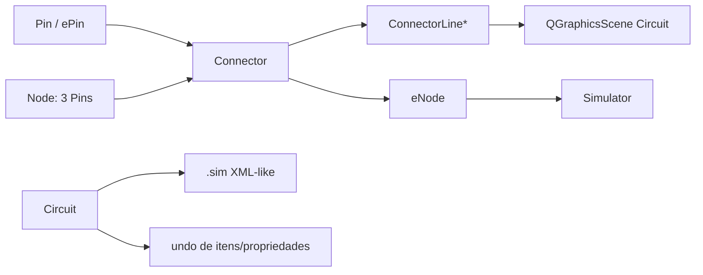
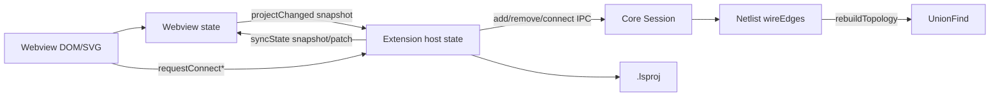
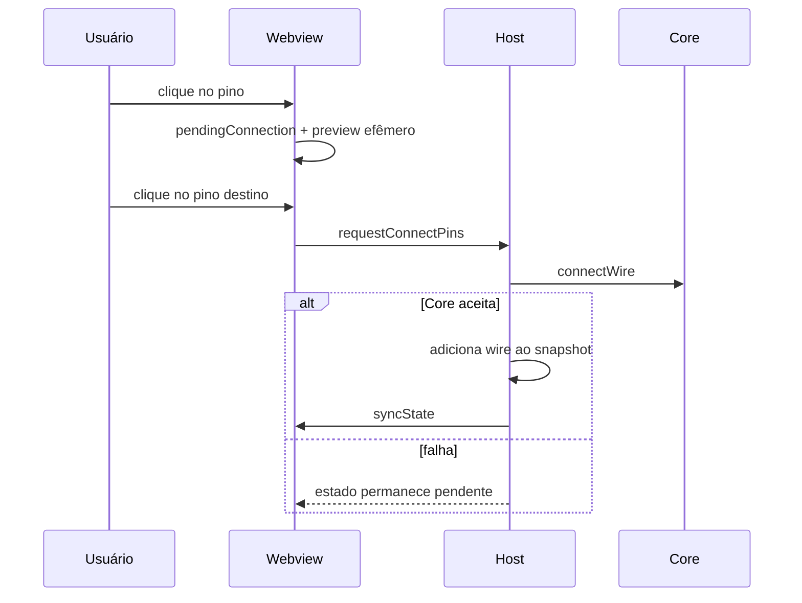
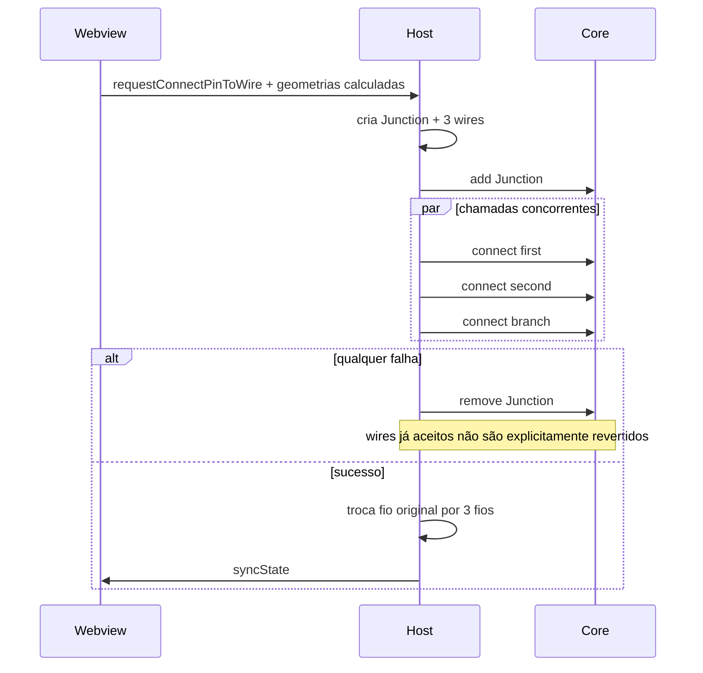
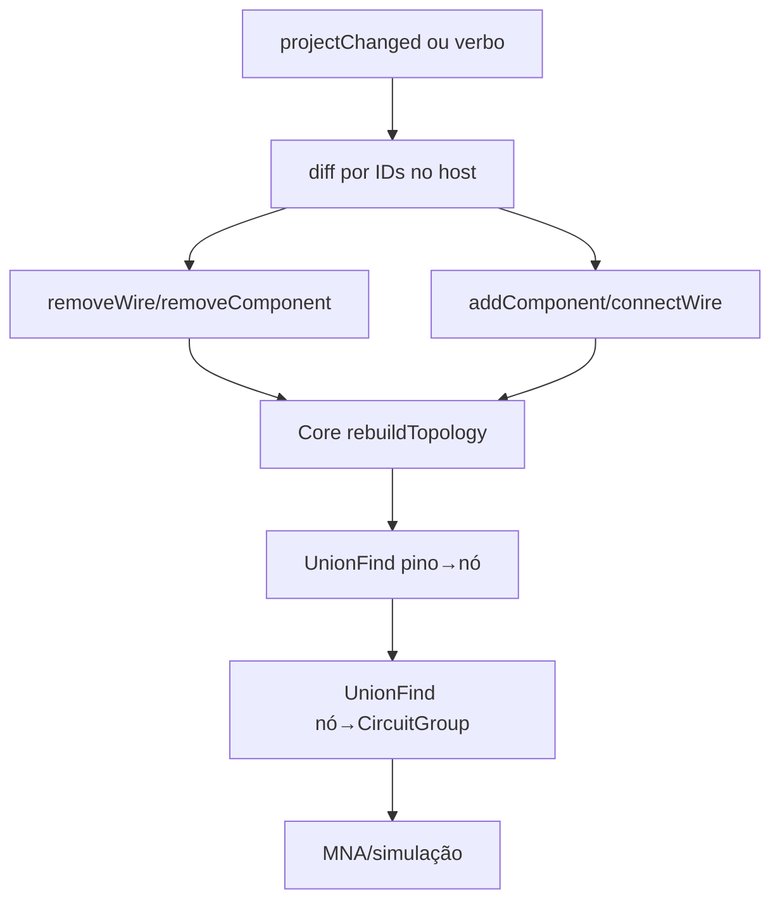
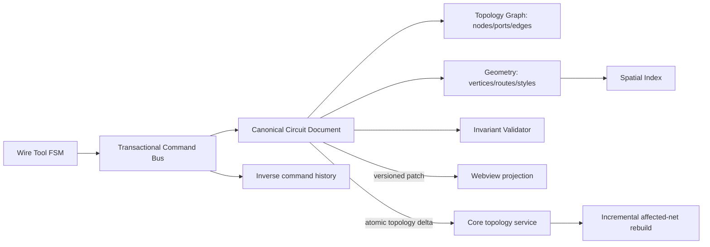
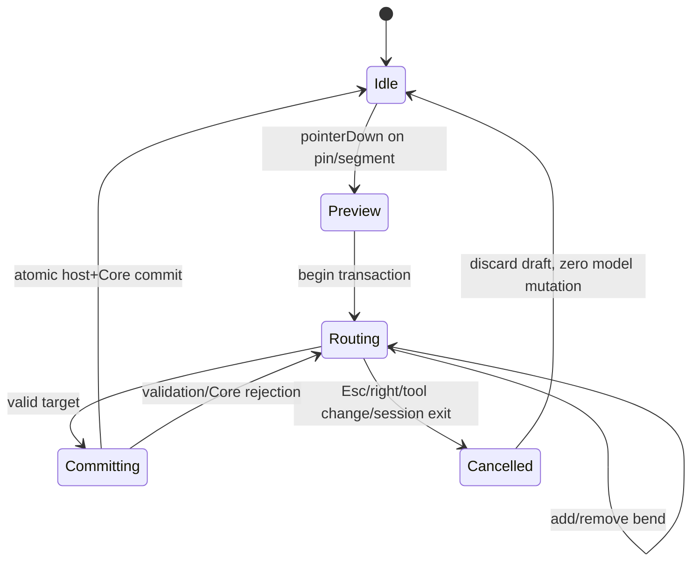

# Auditoria técnica do sistema de fios e conexões

Data: 2026-07-11  
Projeto: LasecSimul  
Referência comparativa: SimulIDE `ed253d6612b1293a320d68d6e27968cd7e6523c4` (2026-05-17)

## Resumo executivo

O LasecSimul possui hoje uma implementação funcionalmente relevante, superior ao que uma inspeção apenas visual sugeriria: criação pino→pino, início e término no meio de fio, split, T, junções de grau arbitrário, cruzamento não conectado, roteamento ortogonal, edição de cantos/segmentos, remoção de nós de grau 0–2, persistência separada de geometria e conectividade, undo/redo por snapshot e reconstrução elétrica por union-find. Os 29 testes unitários de `wireTopology` e os 22 testes de geometria/montagem passaram.

Isso não equivale a uma cadeia robusta de ponta a ponta. Há três fontes de estado — Webview, Extension host e Core — sincronizadas por snapshots, diffs e verbos assíncronos. Operações compostas são enviadas ao Core como várias chamadas independentes; o rollback não remove necessariamente os fios já aceitos. A criação iniciada no meio de um fio já altera permanentemente o modelo/Core antes de o usuário concluir o novo ramo. Cancelar limpa apenas o estado pendente, deixando o split; portanto, o gesto não é transacional. O Core reconstrói toda a topologia a cada alteração elétrica. Não existe índice espacial; hit-test e várias operações percorrem componentes/fios e ainda fazem buscas lineares de componentes por endpoint.

A “bola laranja” atual é a representação DOM/CSS de um componente elétrico persistível `connectors.junction`, não uma pré-visualização. Ela só é desenhada quando o grau calculado é ≥3, não recebe eventos (`pointer-events:none`) e é removida/recriada a cada render. O bug histórico de marcador de grau baixo está mitigado no render e na normalização, mas a entidade subjacente ainda expõe uma falha maior: topologia elétrica é modelada como componente de catálogo/Core. A suíte do Core demonstrou essa fragilidade ao falhar no subcircuito local modificado com `Unknown component typeId: connectors.junction`.

Decisão: **Alternativa D — reconstruir toda a cadeia**, porém por substituição controlada e fatiada. Recomenda-se um documento canônico no host, com grafo topológico explícito separado da geometria, comandos transacionais, índice espacial, patches versionados para a Webview e deltas topológicos atômicos para o Core. O Core deve receber nós/redes, não “componentes junção” artificiais.

## Escopo analisado

Foram inspecionados código TypeScript da Webview/Extension, C++ do Core, contratos IPC, serialização `.lsproj`, testes existentes e a cópia local do SimulIDE. Foram executadas as suítes existentes e um benchmark sintético somente leitura. Não houve correção, refatoração, migração ou criação de teste.

Limitações: não foi feita uma sessão manual completa dentro do VS Code com automação de ponteiro para cada combinação de zoom/grade; não há fixture anexada mostrando a bola original; e o SimulIDE não foi compilado/executado nesta auditoria. Onde só existe prova estática ou unitária, a classificação explicita isso. O arquivo `subcircuits/esp32_devkitc_v4.lssubcircuit` já estava modificado antes da auditoria e foi preservado.

## Arquivos e módulos inspecionados

| Área | Evidências principais | Responsabilidade |
|---|---|---|
| Interação/render | `extension/src/ui/webview/main.ts` | Estado local, gestos, SVG/DOM, seleção, drag, preview, undo/redo |
| Geometria | `wireGeometry.ts` | grade, tolerância, rotas ortogonais, split e movimento |
| Topologia TS | `wireTopology.ts` | hit-test, junção, grau, split, limpeza, normalização, rede de validação |
| Montagem | `wireConnections.ts` | construção pura pino→pino e pino→fio |
| Modelo | `model.ts`, `messages.ts` | `WebviewWireModel`, componentes e mensagens host/webview |
| Orquestração | `extension/src/extension.ts` | validação parcial, mutação do snapshot, chamadas ao Core |
| Persistência | `ProjectSerializer.ts`, `projectCommands.ts`, `ProjectTypes.ts` | validação JSON, projeção visual/elétrica, salvar/carregar |
| IPC | `CoreClient.ts`, `ipc/types.ts`, `core/src/ipc/IpcServer.cpp` | JSON-lines e verbos de componente/fio |
| Core | `Netlist.hpp`, `UnionFind.hpp`, `Junction.hpp`, `coreLifecycle.ts` | arestas elétricas, rebuild, componente-junção |
| Testes | `wire*.test.ts`, `ProjectSerializer.test.ts`, `NetlistTest.cpp`, `UnionFindTest.cpp` | provas unitárias e de integração limitada |
| SimulIDE | `connector.*`, `connectorline.*`, `pin.*`, `node.*`, `circuit.*`, `e-node.*`, `e-pin.*` | referência gráfica/elétrica completa |

## Arquitetura do SimulIDE



`Connector` é simultaneamente conexão elétrica e proprietário de uma lista de `ConnectorLine`; persiste `startpinid`, `endpinid` e `pointList` (`connector.cpp:42-46`). `ConnectorLine` é um item gráfico com shape de hit-test de aproximadamente quatro pixels (`connectorline.cpp:358-388`). `Pin` inicia/fecha o conector (`pin.cpp:209-230`). Durante a criação, `Circuit::newconnector` já instancia um `Connector` e uma linha zero (`circuit.cpp:964-978`); Esc chama `deleteNewConnector`, remove o objeto e cancela o passo de undo (`circuit.cpp:988-994`).

Conectar no meio chama `ConnectorLine::connectToWire`, cria um `Node`, move-o para o ponto e usa `Connector::splitCon` para repartir o conector (`connectorline.cpp:172-224`; `connector.cpp:413-446`). O `Node` tem três pinos fixos co-localizados. Ao perder ramos, `Node::checkRemove` une dois conectores ou remove o restante e apaga o Node (`components/node.cpp:56-101`). Consequência: T é natural; grau >3 exige nós encadeados/sobrepostos, uma limitação que o LasecSimul evita com um pino multi-aresta.

Persistência ocorre no formato de itens: componentes/Nodes primeiro e Connectors por IDs de pinos e lista de pontos. Na carga, o SimulIDE tenta ID e depois posição; conectores inválidos são apenas registrados em log e ignorados (`circuit.cpp:216-281`). A topologia elétrica é construída por registro de `Pin/ePin` em `eNode`; geometria e eletricidade compartilham objetos, o que reduz divergência, mas aumenta acoplamento GUI–simulação.

O undo do SimulIDE envolve `beginUndoStep/endUndoStep`, listas de itens criados/removidos e mudanças de propriedade (`circuit.cpp:698-906`). Split e criação são envolvidos no mesmo passo iniciado no pino. A simulação é desligada em alterações estruturais (`connector.cpp:384-397`), uma política segura, porém menos fluida.

## Arquitetura atual do projeto



O modelo persistente básico é uma lista de componentes e fios. Cada fio referencia dois pares `(componentId,pinId)` e mantém pontos intermediários opcionais. Uma junção é um `WebviewComponentModel` oculto de tipo `connectors.junction`, com um pino compartilhado por N fios (`wireConnections.ts:10-23`). Geometria não é nó de primeira classe: cantos são posições dentro de `wire.points`; só endpoints são referências topológicas.

A alegação de “fonte única” em `wireTopology.ts` é válida apenas para parte dos algoritmos puros. Estado e autoridade continuam duplicados: `main.ts` muta `state`; `extension.ts` mantém `state.schematicState`; o Core mantém instâncias/arestas. `main.ts` também contém wrappers/algoritmos de geometria e posição usados por dezenas de call sites, reconhecendo duplicação deliberada em `wireTopology.ts:24-31`.

## Mapa completo do fluxo de criação de fios



O preview (`pendingWireRoute`, `pendingWirePreviewTarget`) não entra em `components/wires`; `clearPendingWire` limpa os três campos (`main.ts:839-844`). Clique no fundo durante criação acrescenta bend, não finaliza (`main.ts:1241-1245`). Botão direito remove o último bend ou cancela (`main.ts:1259-1265`). Esc passa por `clearPendingWire` no handler de teclado.

## Fluxo atual de finalização e derivação



Para iniciar no meio, `requestStartWireFromWire` executa o split e o envia ao Core antes de armar `pendingConnection` (`extension.ts:821-866`). Cancelar depois não desfaz o split. Isso viola atomicidade do gesto, embora a normalização futura possa colapsar a junção de grau 2.

## Mapa do fluxo de atualização elétrica



`syncProjectSnapshotToCore` compara mapas e envia remoções, componentes e fios sequencialmente (`extension.ts:521-590`). A fila serializa snapshots (`592-599`), evitando corrida entre snapshots, mas verbos especializados usam IIFEs independentes; não há revision/compare-and-swap. `Netlist::connectWire` só acrescenta uma aresta; `disconnectWire` faz busca linear; `rebuildTopology` recria dois union-find desde zero (`Netlist.hpp:156-171,201-230`).

## Validação dos requisitos anexados

| Requisito verificável | Classificação | Evidência / comportamento observado | Risco e recomendação |
|---|---|---|---|
| Iniciar em pino | Implementado e validado unitariamente | `main.ts:4547+`; preview separado | adicionar teste E2E |
| Finalizar em pino | Implementado e validado unitariamente | `requestConnectPins`, teste `wireConnections` | operação Core precisa de revisão |
| Iniciar no meio de segmento | Implementado, mas frágil | `requestStartWireFromWire`, `splitSegmentAtPoint` | split fica após cancelamento |
| Finalizar no meio | Implementado, mas frágil | `requestConnectPinToWire`; teste pino→fio | rollback não é transacional |
| Extremidade/canto existente | Implementado de forma diferente do SimulIDE | prioridade pino/junção e snap de canto | faltam E2E em zoom |
| T e quatro+ ramos | Implementado e validado no modelo | grau N por um único pin; testes grau 3/4 | melhor que Node de 3 pinos |
| Cruzamento sem conexão | Implementado e validado no modelo | teste `rebuildElectricalNet` | visual E2E não comprovado |
| Cruzamento conectado explícito | Parcial | pode terminar/iniciar no segmento | gesto explícito em cruzamento não tem teste E2E |
| Clique próximo ao fio | Implementado, mas frágil | tolerância fixa 8 unidades de canvas | não é screen-space; zoom muda sensação |
| Grade ligada/desligada | Parcial | fios sempre usam `WIRE_GRID_SIZE=8`; configuração é descrita para componentes | comportamento de fio sem grade não comprovado |
| Mover componente conectado | Implementado, mas frágil | endpoints derivam do pin; `maybeAutoJunctionForDraggedComponents` | snapshot/IPC durante drag; autojoin exato |
| Mover junção | Parcial | junção é componente oculto e dot não recebe eventos | usuário não seleciona a bola diretamente |
| Mover segmento/canto | Implementado visual e persistente | `moveOrthogonalWireSegment/Corner`; testes unitários | O(n), sem teste Core de invariância |
| Apagar ramo | Implementado, mas frágil | remoção + `removeOrphanNodes` | atomicidade host/Core não garantida |
| Apagar segmento central | Implementado de forma limitada | seleção de segmento geralmente opera no fio lógico | sem entidade persistente de segmento |
| Apagar componente conectado | Implementado | diff remove fios antes de componente | falta teste ponta a ponta de undo |
| Esc / botão direito | Implementado para preview | `clearPendingWire`; right-click desfaz bend/cancela | não reverte split já commitado |
| Trocar ferramenta/sair de edição | Não foi possível comprovar | estado de ferramenta é disperso | criar FSM e E2E |
| Undo/redo de derivação/exclusão | Implementado, mas frágil | snapshots completos, limite 200 (`main.ts:567-701`) | Core recebe diff posterior, sem transação/revision |
| Salvar/reabrir | Implementado parcialmente | serializer + normalização em projeção | junction depende de registro no Core/subcircuito |
| Nós duplicados | Mitigado, não garantido globalmente | dedup por `Math.round(x):Math.round(y)` | tolerância difere de `samePoint` |
| Segmento zero | Parcial | remove mesmo endpoint; rota pode conter degenerações normalizadas | não valida zero geométrico entre endpoints distintos coincidentes |
| Referência inexistente | Divergência de camadas | serializer rejeita componente ausente; normalizador corta em outros fluxos | regra não uniforme |
| Temporários persistidos | Implementado e validado por inspeção | preview fora de `components/wires` | junction de split cancelado não é temporário para o sistema |
| Bola laranja | Implementada apenas como visualização de nó elétrico | DOM passivo, grau≥3 | cor ambígua, não editável diretamente |
| Tela = Core | Implementado com divergência possível | host só atualiza tela após alguns verbos aceitos | snapshots e rollback parcial quebram garantia absoluta |
| Circuitos grandes | Não atende | benchmark abaixo | índice espacial + comandos/deltas |

## Resultados dos testes

| Execução | Resultado | Interpretação |
|---|---|---|
| `npm --prefix extension test` | passou integralmente | 29 topologia, 20 geometria e 2 montagem; não exercita DOM+host+Core juntos |
| `npm run test:core` | 35/36; falha `esp32_devkitc_subcircuit` | arquivo local modificado contém junction não reconhecida nesse carregador |
| Benchmark sintético | 100/1k/5k abaixo | confirma degradação forte sem índice |

Matriz prática: os cenários pino, split, T, grau 4, cruzamento sem conexão, duplicata, zero endpoint, órfão e idempotência estão cobertos por testes puros. Zoom, grid off, Esc após início-no-fio, troca de ferramenta, saída de sessão, exclusão central, persistência completa com Core, milhares de segmentos no DOM e IPC concorrente permanecem **não comprovados** por execução ponta a ponta. Não se deve convertê-los em “passou” por inferência.

## Investigação da bola laranja

Origem: `renderJunction` cria um `div.junction-dot`, posiciona em `(component.x-4, component.y-4)` e anexa `data-component-id` (`main.ts:5599-5605`). Estilo: círculo 8×8, `background:#f4b942`, contorno escuro e `pointer-events:none` (`styles.css:600-607`). O render só inclui junctions para as quais `isJunctionVisible` retorna grau ≥3 (`main.ts:1621-1681`; `wireTopology.ts`).

Ciclo de vida:

1. Uma divisão cria `WebviewComponentModel(typeId=connectors.junction, hidden=true, pin-1)`.
2. O host armazena em `schematicState.components`, envia como componente pelo IPC e inclui em `.lsproj`.
3. O Core instancia `Junction`, cujo `stamp()` é vazio; o único pino faz a união elétrica (`Junction.hpp:8-20`).
4. O DOM é efêmero: `clearEphemeralCanvasChildren` remove dots antes do rerender.
5. `removeOrphanNodes` elimina/collapse grau 0–2 quando chamado; não é chamado por `clearPendingWire`.

Conclusão: não é marcador de seleção, snap ou preview; é um marcador visual passivo de uma entidade topológica/elétrica persistida. A bola em grau ≥3 possui significado elétrico; não é selecionável/removível diretamente. Uma bola persistente sem três ramos indicaria estado que escapou da normalização ou render antigo. O risco arquitetural é maior que a cor: uma relação topológica foi promovida a “componente” e precisa existir em catálogo, persistência, IPC, Core e carregadores de subcircuito.

## Matriz comparativa SimulIDE × projeto

| Critério | SimulIDE | Projeto atual | Melhor solução | Avaliação atual |
|---|---|---|---|---|
| Modelo de fios | Connector com lista de linhas | wire endpoint→endpoint + points | edge topológica + route geométrica | projeto mais simples, limitado |
| Segmentos | objetos `ConnectorLine` | implícitos entre pontos | IDs estáveis para trechos editáveis | SimulIDE melhor para edição |
| Nós/junções | Node de 3 pins | junction 1 pin/N arestas | TopologyNode sem componente | projeto funcionalmente superior, arquitetura incompleta |
| Redes | eNode acoplado ao objeto | UnionFind no Core | grafo canônico + rede incremental | projeto mais desacoplado |
| Hit testing | QGraphicsScene index/shape | varredura manual | R-tree/spatial hash screen-aware | projeto pior |
| Snap | grid/linha no item | 8 fixo em módulo | política central em screen-space | equivalente, ambos limitados |
| Split | item chama Node/splitCon | função pura + montagem host | comando transacional | projeto testável, incompleto |
| Cruzamentos | Node explícito conecta | IDs explícitos conectam | junction explícita | equivalente |
| Movimento | objetos atualizam rotas | deriva endpoints + muta points | constraint solver local | não comparável |
| Exclusão | Node colapsa conectores | normalizador grau 0–2 | comando atômico + invariantes | equivalente na intenção |
| Cancelamento | remove objeto novo e cancela undo | limpa preview; split pode ficar | rollback integral | SimulIDE melhor |
| Undo/redo | delta de itens/propriedades | snapshots clonados/JSON | command pattern inversível | SimulIDE melhor em escala |
| Persistência | itens XML-like acoplados | JSON elétrico+visual separado | schema explícito de grafo/rotas | projeto melhor base |
| Normalização | `remNullLines`, Node cleanup | funções puras idempotentes | invariantes em cada comando + load | projeto melhor/testável |
| Integração Core | no mesmo processo/objetos | IPC + netlist separado | delta atômico versionado | projeto tecnicamente superior, incompleto |
| Desempenho | índice do QGraphicsScene | loops lineares/aninhados | índice espacial + adjacência | projeto pior |
| Escalabilidade | Node 3-pin limita grau | grau arbitrário | grau arbitrário explícito | projeto melhor |
| Testabilidade | forte acoplamento Qt | módulos puros | kernel headless canônico | projeto melhor |
| UX | madura, gesto direto | moderna, mas inconsistências de transação/zoom | feedback de snap/junction e preview sem commit | SimulIDE hoje melhor |

## Diferenças funcionais, arquiteturais e de UX

O projeto suporta grau arbitrário em um nó sem encadear Nodes, separa geometria de conectividade no arquivo e consegue testar topologia sem GUI. O SimulIDE, por outro lado, possui item espacial por segmento, cancelamento realmente associado ao objeto em construção e uma cadeia única de objetos entre cena e eletricidade.

No LasecSimul, a tolerância é em coordenadas de canvas; não há conversão para uma tolerância constante em pixels de tela. Assim, zoom altera a dificuldade percebida. A indicação de snap é indireta pelo preview. Cruzamento conectado e não conectado não têm affordance formal além da bola. Junction dot é passivo, logo mover uma junção diretamente não é uma interação natural.

## Análise de desempenho

Benchmark Node 2026-07-11, release JS já compilado, cenário linear e hit miss (100 repetições):

| Segmentos | hit-test médio | normalização |
|---:|---:|---:|
| 100 | 0,241 ms | 1,735 ms |
| 1.000 | 5,687 ms | 26,229 ms |
| 5.000 | 132,882 ms | 620,818 ms |

O hit-test percorre todos os pinos e fios; para cada endpoint, `pinScenePosition` usa `components.find`, produzindo comportamento O(W·C) em rotas. `wireDegree` é O(W). `removeOrphanNodes` faz filtros repetidos por junction e pode chegar a O(J·W·passes). Undo calcula `JSON.stringify` de componentes/fios em cada `persistState` e clona snapshots nos commits. Host calcula mapas O(C+W), mas transmite snapshots completos Webview→host. Core `disconnectWire` é O(E) e `rebuildTopology` é global O(P+E α(P)) a cada alteração.

O benchmark não mede DOM/SVG, IPC ou Core; portanto é piso, não teto, do custo percebido. Em 5.000 segmentos, só o kernel de hit-test já excede em várias vezes o orçamento de 16,7 ms.

## Análise de escalabilidade e versatilidade futura

Fios ortogonais e edição por arraste existem. Ângulos livres, barramentos, labels de rede, túneis e subcircuitos podem ser adicionados, mas o modelo `wire.points` sem entidades geométricas estáveis dificulta constraints, roteamento e seleção parcial. Barramentos não devem ser simulados como um pin multi-aresta simples. Colaboração/event sourcing fica inviável com snapshots sem revisão e IDs gerados localmente por sequência/tempo. Roteamento automático precisa de índice de obstáculos; grandes circuitos precisam de viewport culling e dirty regions.

Não se recomenda half-edge: é excelente para subdivisões planares, mas cruzamentos sem conexão e múltiplas camadas tornam a planarização artificial. Adjacency lists + edges/vertices explícitos são suficientes. Union-find continua adequado para rebuild e adições; deleções exigem recomputação apenas do componente conexo afetado ou uma estrutura dinâmica mais complexa, que só deve ser adotada se benchmarks justificarem.

## Invariantes obrigatórios

| Invariante | Estado atual |
|---|---|
| nenhum segmento zero | parcial; endpoints iguais removidos, todos os pares geométricos não são validados globalmente |
| nenhum nó lógico duplicado | parcial; dedup por arredondamento, não por identidade transacional |
| nenhum temporário persistido | preview sim; split cancelado não |
| cancelamento sem órfãos | violável no início sobre fio |
| endpoint referencia nó/pino válido | serializer valida componente; pinId e outros carregadores divergem |
| visual = elétrico | não garantido atomicamente |
| cruzamento sem junction isolado | garantido pelo modelo e teste puro |
| derivação explícita compartilha rede | garantido pelo teste puro |
| edição atômica | não garantida |
| undo/redo restaura ambas | provável por snapshot; integração E2E não comprovada |
| Core nunca recebe rede parcial | violável por várias chamadas IPC |
| persistência sem transitórios | preview garantido; junction intermediária pode sobreviver |
| IDs independentes de coordenada | sim |
| tolerâncias centralizadas | parcial |
| uma fonte de verdade | não |

## Débitos técnicos e riscos

| Débito | Criticidade | Impacto | Regressão | Correção/alcance | Prioridade |
|---|---|---|---|---|---|
| operação composta não atômica no Core | crítico | elétrico/corrupção transitória | alto | alto, IPC+Core | P0 |
| split commitado antes de concluir gesto | alto | UX/topologia/undo | alto | médio | P0 |
| junction como componente artificial | alto | carregamento/Core/evolução | alto | alto | P0 |
| três autoridades sem revisão | crítico | divergência visual-elétrica | alto | alto | P0 |
| ausência de índice espacial | alto | interação >1k segmentos | médio | médio | P1 |
| normalização potencialmente quadrática | alto | load/edit grandes | médio | médio | P1 |
| snapshot/JSON/clone em undo e sync | médio | memória/latência | médio | médio | P1 |
| tolerância não screen-space | médio | UX em zoom | baixo | baixo | P1 |
| regras diferentes entre serializers/loaders | alto | perda/rejeição de circuito | alto | médio | P0 |
| falta de E2E dos gestos críticos | alto | regressões silenciosas | alto | médio | P0 |
| Core append-only para slots/instâncias | médio | sessão longa/memória | baixo | alto | P2 |

## Pontos em que nosso projeto é melhor

- Grau de junction ilimitado, contra três pins fixos no Node do SimulIDE.
- Funções puras e testes headless de geometria/topologia.
- Separação explícita entre endpoints elétricos e pontos visuais na persistência.
- Core sem dependência de Qt e simulação isolada por IPC.
- Normalização idempotente e teste explícito de cruzamento sem conexão.

## Pontos em que o SimulIDE é melhor

- Índice/hit-test provido pela cena e segmentos como itens editáveis.
- Objeto em criação e passo de undo têm ciclo de vida único; Esc remove tudo.
- Menos oportunidades de divergência entre GUI e simulador por compartilhar objetos.
- Fluxos de edição amadurecidos, incluindo split e limpeza local de Node.

## Oportunidades de superar o SimulIDE

Um grafo canônico sem Node de três pins, transações atômicas, índice espacial, junctions de N ramos, roteamento independente e patches incrementais combinam a testabilidade atual com uma UX mais previsível que a do SimulIDE. A solução pode ainda oferecer diagnóstico de rede, realce elétrico, labels, buses tipados e colaboração, impossíveis de sustentar bem sobre o acoplamento Qt legado.

## Decisão arquitetural recomendada

**Alternativa D — reconstruir toda a cadeia.** A razão não é volume de bugs visuais, mas a ausência de uma fronteira transacional única entre gesto, modelo, IPC e Core. Corrigir apenas `main.ts` ou `wireTopology.ts` preservaria junction artificial, snapshots concorrentes e rebuild global. A implantação deve ser progressiva internamente, mas sem adaptador legado permanente ou compatibilidade obrigatória de arquivo.

## Arquitetura-alvo proposta



Modelo proposto: `TopologyNode{id}`, `PortRef{componentId,pinId}`, `Conductor{id,nodeA,nodeB}`, `Route{id,conductorId,vertexIds}`, `RouteVertex{id,x,y,kind}`, `JunctionView{nodeId,position}` derivada, nunca componente. Pins pertencem a nodes por ligação explícita. Cruzamento só conecta quando compartilha `TopologyNode`.

### Máquina de estados proposta



### Fluxo transacional e atualização incremental

```mermaid
sequenceDiagram
  participant V as View/FSM
  participant H as Canonical Host
  participant C as Core
  V->>H: CommitWireCommand(baseRevision, draft)
  H->>H: clone affected subgraph + validate invariants
  H->>C: ApplyTopologyTransaction(txId, delta)
  C->>C: validate + rebuild affected connected components
  C-->>H: committed(newRevision) / rejected
  alt committed
    H->>H: publish document revision + inverse command
    H-->>V: patch(newRevision)
  else rejected
    H-->>V: error; draft remains editable
  end
```

## Plano de ação em fases

| Fase | Objetivo e componentes | Remover/criar/APIs | Testes e conclusão | Esforço / paralelo |
|---|---|---|---|---|
| 0 | congelar contratos e instrumentar `main`, host, IPC, Core | criar tracing de revision/tx e benchmark runner | reproduções E2E e baseline 100/1k/10k | M; paralelo com 1 |
| 1 | kernel canônico headless | criar `CircuitDocument`, `TopologyGraph`, `GeometryStore`, invariants; não usar `WebviewComponentModel` como domínio | property-based, fuzz load, invariantes após cada comando | XL; núcleo sequencial |
| 2 | comandos/FSM | substituir mutações e snapshots por command bus, drafts e inversas | cancelar em todos os fluxos deixa hash idêntico; undo/redo diferencial | L; UI e kernel em paralelo após API |
| 3 | índice espacial/render | criar R-tree ou spatial hash de segmentos/pins, viewport culling, screen-space tolerance | p95 hit <2 ms a 10k; pan 60 fps | L; paralelo com 4 |
| 4 | IPC/Core transacional | `ApplyTopologyTransaction`, revision, validação; remover `Junction` como componente | fault injection em cada etapa; nunca estado parcial | XL; Core/host paralelos |
| 5 | redes incrementais | adjacency e dirty connected components; manter full rebuild como oracle de teste | diferencial incremental×full em sequências aleatórias | L/XL; após 1 e 4 |
| 6 | persistência v2 incompatível | JSON com nodes/conductors/routes; loader valida e normaliza antes de publicar | golden files, corruptos, round-trip determinístico | L; paralelo após 1 |
| 7 | migração da Webview e remoção legado | remover junction component, handlers `requestConnect*`, snapshots completos e normalizadores duplicados | todos E2E/benchmarks; busca confirma código morto removido | XL; integração sequencial |
| 8 | UX avançada | feedback de snap, conexão/cruzamento explícitos, drag junction/rede, diagnóstico | testes perceptuais e acessibilidade; avaliação comparativa | L; após 3/7 |

Impactos: `main.ts` perde autoridade de domínio; `extension.ts` vira controlador do documento; `messages.ts` usa comandos/patches revisionados; `ProjectSerializer` ganha schema v2; `Junction.hpp` e registro correspondente são removidos; `Netlist` recebe deltas de nós/arestas; testes atuais de funções puras são reaproveitados como oracle e depois adaptados ao kernel.

## Estratégia de testes

1. Testes unitários de geometria, grafo e comandos inversos.
2. Property-based/fuzz: qualquer sequência válida mantém invariantes; qualquer cancelamento preserva o hash.
3. Diferenciais: rede incremental = full union-find; persistência round-trip = documento normalizado.
4. Integração host/Core com fault injection em cada suboperação.
5. E2E Playwright/Webview para toda a matriz solicitada, com zoom 25/50/100/200/400%, grid on/off e mouse impreciso.
6. Stress 100, 1k, 10k e 100k segmentos; sessões de 10k comandos; heap e IPC monitorados.
7. Comparação manual lado a lado com a revisão do SimulIDE auditada.

## Benchmarks propostos

| Métrica | Meta de aceite |
|---|---|
| hit-test 10k segmentos | p95 < 2 ms, p99 < 4 ms |
| pointer preview 10k | p95 < 8 ms; nenhuma frame >16,7 ms em 95% da sessão |
| commit de derivação | p95 host <10 ms; host+Core <30 ms local |
| cancelamento | <5 ms e zero diferença no documento/Core |
| carregar 10k | <500 ms em máquina de referência |
| salvar 10k | <250 ms e JSON determinístico |
| rede incremental | tocar apenas componente conexo afetado; p95 <10 ms em edição local |
| IPC | 1 request + 1 response + 1 patch por comando; zero snapshots completos em edição |
| memória undo 200 passos | <2× documento vivo para comandos típicos |

## Critérios de aceite

- Derivação pode iniciar/terminar em qualquer ponto válido e é uma única transação.
- Cancelar por Esc, botão direito, troca de ferramenta ou sessão não deixa qualquer diferença.
- Visual e Core compartilham a mesma revision confirmada; nenhum estado parcial é observável.
- Zero junction artificial, marcador temporário persistido, nó duplicado ou segmento zero.
- Cruzamentos só conectam por comando explícito.
- Undo/redo restaura geometria, topologia e revision do Core.
- Load inválido falha antes de publicar; load válido resulta normalizado.
- Metas de benchmark acima passam em CI de performance dedicada.
- Matriz E2E integral passa em dois engines de Webview suportados.

## Ordem recomendada de execução

Instrumentação e testes de caracterização → kernel canônico/invariantes → comandos/FSM → IPC transacional → persistência v2 → índice/render → rede incremental → migração integral da Webview → remoção do legado → UX avançada. Não iniciar pela cor/seleção da bola; ela desaparece naturalmente quando junction vira projeção de um nó.

## Conclusão técnica

O sistema atual já resolve boa parte da semântica básica e contém trabalho de qualidade em funções puras e testes. Seu problema central é sistêmico: o gesto não é a transação, a Webview não é apenas uma projeção, o Core não recebe mudanças compostas atomicamente e uma junction topológica precisa fingir ser componente em toda a cadeia. Isso explica tanto resíduos após cancelamento quanto risco de divergência e falha de carregamento.

A arquitetura-alvo proposta preserva os melhores elementos atuais — endpoints por IDs, grau arbitrário, módulos headless e Core isolado — e substitui snapshots, junction artificial, varreduras globais e commits parciais. Com os critérios mensuráveis acima, ela pode superar o SimulIDE em correção topológica, escalabilidade, testabilidade e versatilidade sem herdar a limitação estrutural de Nodes de três pinos.
